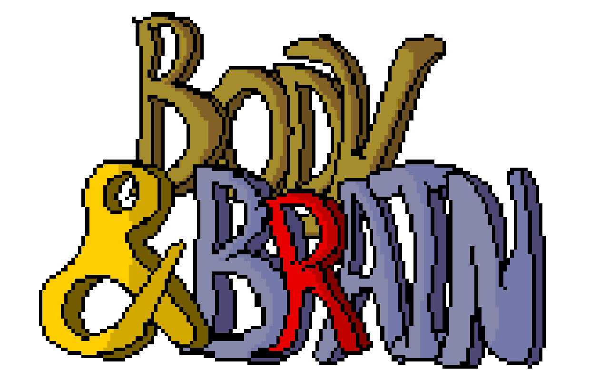

# Body And Brain - A Simple Role-Playing System

<!-- !toc -->

* [Body And Brain - A Simple Role-Playing System](#body-and-brain-a-simple-role-playing-system)
  * [Overview](#overview)
  * [Character Creation](#character-creation)
    * [Stats](#stats)
    * [Skill Level Bonus](#skill-level-bonus)
    * [Character Stats](#character-stats)
  * [Races](#races)
    * [Elf](#elf)
    * [Human](#human)
    * [Half-Elf](#half-elf)
    * [Dwarf](#dwarf)
    * [Halfling](#halfling)
    * [Reptilian](#reptilian)
    * [Feline](#feline)
    * [Orc](#orc)
  * [Professions](#professions)
    * [Fighter](#fighter)
    * [Berserker](#berserker)
    * [Paladin](#paladin)
    * [Ranger](#ranger)
    * [Thief](#thief)
    * [Bard](#bard)
    * [Wizard](#wizard)
    * [Conjuror](#conjuror)
    * [Cleric](#cleric)
  * [Appendices](#appendices)
    * [Fan Support](#fan-support)
    * [Licensing](#licensing)

<!-- toc! -->

<!-- include (1-Overview.md) -->
## Overview

_____

Body and Brain (BaB) is a simple RPG system designed from the ground up to be suitable for both table-top play and computer play. BaB is created for new and experienced gamers alike, offering a slim set of rules that reduces the overhead of the gaming experience; thus, allowing new game masters to acclimate quickly and experienced game masters to keep their campaign moving.

Players of BaB benefit from a simple character sheet requiring little math to set up and get playing. Players get clear and concise instructions for creating, playing and leveling their character.

Creating game modules for BaB is a breeze due to simplified NPC selection and customization. Terrain effects are standardized for physical attack and maneuvers.

```todo
TODO: Let's add some more here!
```
<!-- /include -->

<!-- include (2-Character_Creation.md) -->
## Character Creation

_____

### Stats

The first step in generating a Body and Brain character is to make fourteen [D10](#D10) rolls, throw out the low and the high rolls, and sum the remaining rolls, giving you the player stat pool. Next, add the player stat pool to 400 to get your total stat pool. You may only have one stat of 100, one stat of 99, and two stats between 95 to 98. The rest of the stat pool may be allocated freely for stats of 94 and lower. A character may not earn more than 14 skill points per level for either the Body or Brain groups.

#### Selecting a [Profession](#professions)

The next step is to pick a Profession from *[Table 1-1](#table-1-1)*. Using the primary stat group (Body or Brain) as your guide, allocate your stat pool among the Body Stats:

* [Strength](#strength)
* [Agility](#agility)
* [Constitution](#constitution)

and the Brain Stats:

* [Intelligence](#intelligence)
* [Presence](#presence)
* [Piety](#piety)  

###### Table 1-1

|Primary Stat|Profession
|:--|:--
|Presence|[Ranger](#ranger)
|Presence|[Bard](#bard)
|Constitution|[Fighter](#fighter)
|Strength|[Berserker](#berserker)
|Piety|[Paladin](#paladin)
|Agility|[Thief](#thief)
|Intelligence|[Wizard](#wizard)
|Intelligence|[Conjuror](#conjuror)
|Piety|[Cleric](#cleric)

#### Selecting a [Race](#races)

The next step is to pick a Race from the Races available for your chosen profession (See *[Table 1-2](#table-1-2)*). After doing so, you enter the Racial Stat Bonuses for the individual stats (See *[Table 1-3](#table-1-3)*).

###### Table 1-2

|[Human](#human)|[Half-Elf](#half-elf)|[Elf](#elf)|[Dwarf](#dwarf)|[Halfling](#halfling)|[Reptilian](#reptilian)|[Orc](#orc)|[Feline](#feline)
|:--|:--|:--|:--|:--|:--|:--|:--
|Bard|Bard|Bard|Berserker|Bard|Berserker|Fighter|Bard
|Berserker|Conjurer|Conjurer|Cleric|Cleric|Cleric|Berserker|Conjurer
|Cleric|Fighter|Ranger|Conjurer|Conjurer|Conjurer|Cleric|Ranger
|Conjurer|Ranger|Thief|Fighter|Ranger|Fighter||Thief
|Fighter|Thief|Wizard|Paladin|Thief|Paladin||Wizard
|Paladin|Wizard||Wizard|Wizard|Wizard||
|Ranger|||||||
|Thief|||||||
|Wizard|||||||

###### Table 1-3

|Statistic|Human|Half-Elf|Elf|Dwarf|Halfling|Reptilian|Orc|Feline
|:--|:--|:--|:--|:--|:--|:--|:--|:--
|Strength|2|1|0|2|-1|2|3|-1
|Agility|1|2|3|-1|2|-1|0|3
|Constitution|1|1|0|2|0|1|2|0
|Intelligence|0|1|2|0|1|0|-3|0
|Presence|0|1|2|0|2|0|-1|3
|Piety|0|-2|-3|1|0|2|0|-1

#### Base Bonus

In addition to racial stat bonuses, stats also have an associated base bonus. *[Table 1-4](#table-1-4)* shows the bonus that an individual stat receives based on its value.

###### Table 1-4

|Range|Bonus
|:--|:-:
|1|-5
|2 to 10|-3
|11 to 25|-1
|26 to 49|0
|50 to 75|1
|76 to 89|2
|90 to 94|3
|95 to 98|4
|99|7
|100|10

#### Skills

Skills levels determine your effectiveness at using a specific skill. Skills are
broken down into seven sections:

* [Weapons](#weapon-skills)
* [Armor](#armor-skills)
* [Physical Skills](#physical-skills)
* [Mental Abilities](#mental-abilities)
* [Mixed Abilities](#mixed-abilities)
* [Arcane Skills](#arcane-skills)
* [Other Skills](#other-skills)

Skills are developed by spending skill points which are earned each level based on your stats. Using *[Table 1-5](#table-1-5),* assign skill points based on the stat value, keeping in mind that you may not exceed 14 skill points for either the Body or Brain group.

###### Table 1-5

|Range|Skill Points
|:--|--:
|1|0
|2 to 10|0
|11 to 25|0
|26 to 49|0
|50 to 75|1
|76 to 89|2
|90 to 94|3
|95 to 98|4
|99|5
|100|7

#### Weapon Skills

Developing weapon skills is performed by allocating skill points to skill levels. Using *[Table 1-6](#table-1-6)*, a Fighter can spend one skill point for one skill level for their Primary Melee or Primary Missile weapons. A fighter can then spend three skill points for one skill level for their Secondary Melee or Secondary Missile weapons. Our fighter’s Tertiary weapons require spending seven skill points for one skill level.

###### Table 1-6

|Primary Stat|Skill|Fighter|Berserker|Paladin|Ranger|Rogue|Bard|Wizard|Conjuror|Cleric
|:--|:--|:-:|:-:|:-:|:-:|:-:|:-:|:-:|:-:|:-:
|Strength|Primary Melee|1/3/7|1/3/7|1/3/7|2/5|2/5|2/5|7|5|2/5
|Agility|Primary Missile|1/3/7|2/5|2/5|1/3/7|2/5|3|5|10|4
|Strength|Secondary Melee|3/7|2/5|3/7|4|6|4|15|15|6
|Agility|Secondary Missile|3/7|4|5|2/5|6|6|10|20|12
|Strength|Tertiary Melee|7|4|7|10|11|12|20|40|10
|Agility|Tertiary Missile|7|9|10|4|11|14|20|40|20

#### Armor Skills

Armor is a bit simpler. The player can allocate skill points to specific armor types same as is done for weapons, but the skill points costs are fixed per armor type. Our fighter can thus allocate the number of skill points denoted in *[Table 1-7](#table-1-7)* for one skill level.

###### Table 1-7

|Primary Stat|Skill|Fighter|Berserker|Paladin|Ranger|Rogue|Bard|Wizard|Conjuror|Cleric
|:--|:--|:-:|:-:|:-:|:-:|:-:|:-:|:-:|:-:|:-:
|Agility|None or Light Clothing|1/3/5|1/3/5|1/3/5|1/3/5|1/3/5|1/3/5|3|2|1/3/5
|Agility|Robes|1/3/5|1/3/5|1/3/5|1/3/5|1/3/5|1/3/5|3|2|1/3/5
|Agility/Strength|Soft Leather|1/3/5|1/3/5|1/3/5|5|3/7|3/7|-|8|1/3/5
|Agility/Constitution|Rigid Leather|3/7|2/6|3/7|10|7|5|-|-|3
|Strength|Chain|5/10|4|5|-|-|10|-|-|5
|Strength/Constitution|Plate|7|-|7|-|-|-|-|-|7
|Strength|Helm|1|1|2|-|-|-|-|-|-
|Strength|Shield|1|-|1|-|-|4|-|-|1

#### Physical Skills

Physical Skills encompass actions that be taken by a character that primarily depend upon the Body stats of the character.

###### Table 1-8

|Primary Stat|Skill|Fighter|Berserker|Paladin|Ranger|Rogue|Bard|Wizard|Conjuror|Cleric
|:--|:--|:-:|:-:|:-:|:-:|:-:|:-:|:-:|:-:|:-:
|Agility|Sprint|3|2|3|2|2|3|8|6|5
|Constitution|Run|3|3|3|2|2|2|7|5|4
|Agility|Swim|3|5|5|1|2|3|10|7|7
|Strength|Climb|3|5|4|1|1|3|8|8|5
|Body|Body General|3|4|4|2|2|3|8|7|5

#### Mental Abilities

###### Table 1-9

|Skill Points Per Level|Skill|Fighter|Berserker|Paladin|Ranger|Rogue|Bard|Wizard|Conjuror|Cleric
|:--|:--|:-:|:-:|:-:|:-:|:-:|:-:|:-:|:-:|:-:
|Presence|Traps|8|20|10|2|1/3|3|5|3|4
|Intelligence|Locks|8|20|10|4|1/3|3|5|3|4
|Presence/Piety|Persuasion|8|15|3|4|3|1/3|2|4|1
|Intelligence|Item Lore|10|15|7|10|1/3|2|1/3|1/3|3
|Intelligence|Read Runes|10||4|5|3|2|1/3|2|2
|Presence|Use Item|7|15|4|5|3|1/3|2|1/3|2
|Mind|Brain General|8|17|8|5|2|3|4|3|3

#### Mixed Abilities

###### Table 1-10

|Primary Stat|Skill|Fighter|Berserker|Paladin|Ranger|Rogue|Bard|Wizard|Conjuror|Cleric
|:--|:--|:-:|:-:|:-:|:-:|:-:|:-:|:-:|:-:|:-:
|Agility/Presence|Stealing|7|10||4|1/3|3|7|6|
|Agility/Intelligence|Tracking|10|15|15|1/3|4|3|10|6|10
|Constitution/Presence|Hiding|8|10|10|1/3|1/3|3|8|6|8
|Agility/Presence|Balancing|6|5|7|2|1|3|5|5|5
|Mind/Body|Mixed General|8|10|10|3|2|3|8|6|8

#### Arcane Skills

###### Table 1-11

|Primary Stat|Skill|Fighter|Berserker|Paladin|Ranger|Rogue|Bard|Wizard|Conjuror|Cleric
|:--|:--|:-:|:-:|:-:|:-:|:-:|:-:|:-:|:-:|:-:
|Intelligence|Enchantment|40/-/-|-|-|40/-/-|40/-/-|7/12/20|1/3/7|7/-/-|-
|Presence|Conjuring|30/-/-|-|-|30/-/-|40/-/-|7/12/20|7/-/-|1/3/7|-
|Piety|Prayer|25/-/-|-|7/12/-|25/-/-|-|-|-|-|1/3/3
|Piety|Leadership|-|-|4/7/12|-|-|-|-|-|-
|Intelligence|Naturalist|-|-|-|4/7/12|-|-|-|-|-
|Presence|Songs|-|-|-|-|-|2/6/10|-|-|-

#### Other Skills

###### Table 1-12

|Primary Stat|Skill|Fighter|Berserker|Paladin|Ranger|Rogue|Bard|Wizard|Conjuror|Cleric
|:--|:--|:-:|:-:|:-:|:-:|:-:|:-:|:-:|:-:|:-:
|Presence|Perception|5|15|5|1|1|5|1|5|5
|Constitution|Body Development|2|1|4|5|7|6|25|15|4

### Skill Level Bonus

###### Table 1-13

|Skill Level|Bonus
|:-:|:-:
|0|-5
|1|5
|2|10
|3|15
|4|19
|5|23
|6|26
|7|29
|8|31
|9|33
|10|34

### Character Stats

Body and Brain uses six basic stats that describe a characters attributes that affect gameplay.

#### Body

There are three stats that define the Body category: [Strength](#strength), [Agility](#agility) and [Constitution](#constitution).

##### Strength

Strength is the ability to apply physical force to an object.  Doing things like swinging a sword requires strength to move it.  Strength also is required to wear heavy armor. Marching headlong into battle with heavy weapons, the [Berserker](#berserker) must be strong to swing those massive weapons with the force to kill their enemies quickly.

##### Agility

Agility is the ability to control your body.  Whether it's fine motor control picking locks, or aiming a bow, Agility allows the character to do these things effortlessly. [Thieves](#thief) use their Agility in nearly all things they do.

##### Constitution

Constitution is your body's resilience to stresses acting upon it.  The amount of damage you can take before going down and the ability to shoulder heavy loads for long periods of time are determined by a character's Constitution. As the tough guys of the world of Body and Brain, [Fighters](#fighter) depend greatly on their constitution to wear heavy armor and keep in the fight.

#### Brain

There are three stats that define the Brain category: [Intelligence](#intelligence), [Presence](#presence) and [Piety](#piety).

##### Intelligence

Intelligence is the measure of a character's ability to gain and retain knowledge, and then recall that knowledge and apply it to an action such as casting a spell or reading a scroll during combat.  Of all the classes, [Wizards](#wizard) and [Sorcerors](#Sorceror) are the most dependent on Intelligence.

##### Presence

Presence is both the character's ability to perceive the world around him and to project himself into that world.  A [Bard](#bard) depends on his presence to react to others as well as influence them. [Rangers](#ranger) depend on Presence to help them be aware of their quarry and know when the tables have been turned.

##### Piety

Piety is the connection that a character has to his patron Gods.  [Clerics](#cleric) and [Paladins](#paladin) draw upon this Piety to curry favor that is called upon to support the party through healing and calm, as well as to be especially fierce when fighting the [Undead](#Undead).
<!-- /include -->

<!-- include (3-Races.md) -->
## Races

_____

Body and Brain is built around normal fantasy races, but that does not mean we need to stop there!  You are encouraged to create and add more races to the Appendices.

### Elf

Elves are the oldest race in Body and Brain, and are practically immortal.  No Elf has ever died of old age and very few have died of disease. Combat and poison, on the other hand, have claimed many Elves over the millennia.

Elves are very intelligent, perceptive and wise.  They have a great presence about them and the more gregarious of them tend to be [Bards](#bard), with many specializing in [acting](#Acting) while others with a more adventurous side going into [fencing](#Fencing) or [politics](#Politics).

Elves are slight of frame, but are not impeded in the arena of [Strength](#strength), and are especially agile.  Their combination of [Agility](#agility), [Presence](#presence) and [Intelligence](#intelligence) makes them excellent [Rangers](#ranger) and [Thieves](#thief).  [Piety](#piety) is the Elf's Achilles Heel since they consider themselves akin to the Gods and are not very modest about it, which means that Elves cannot be [Paladins](#paladin) or [Clerics](#cleric).

#### [Professions](#professions) Available to Elves

* [Bard](#bard)
* [Conjuror](#conjuror)
* [Ranger](#ranger)
* [Thief](#thief)
* [Wizard](#wizard)

#### Stat Bonuses for Elves

|Stat|Bonus
|:--|:-:
|[Strength](#strength)|0
|[Agility](#agility)|3
|[Constitution](#constitution)|0
|[Intelligence](#intelligence)|2
|[Presence](#presence)|2
|[Piety](#piety)|-3

#### Resistances for Elves

|Affliction|Elf
|:--|:--
|[Poison](#Poison)|1
|[Disease](#Disease)|2
|[Wizardry](#Wizardry)|0
|[Conjuring](#Conjuring)|0
|[Curses](#Curses)|-2

### Human

Humans arose a long time after the [Elves](#elf).  As their numbers grew, they became jealous of the Elves' long lifespan, and that jealousy led to many wars between the two races.  Humans are more well rounded than Elves, displaying excellent [Strength](#strength), [Constitution](#constitution) and [Agility](#agility), all of which serve them well as the jack-of-all trades in Body and Brain.  Humans can excel at all of the [professions](#3-Professions) equally well.

#### [Professions](#professions) Available to Humans

* [Bard](#bard)
* [Berserker](#berserker)
* [Cleric](#cleric)
* [Conjuror](#conjuror)
* [Fighter](#fighter)
* [Paladin](#paladin)
* [Ranger](#ranger)
* [Thief](#thief)
* [Wizard](#wizard)

#### Stat Bonuses for Humans

|Statistic|Bonus
|:--|:-:
|Strength|2
|Agility|1
|Constitution|1
|Intelligence|0
|Presence|0
|Piety|0

#### Resistances for Humans

|Affliction|Human
|:--|:--
|Poison|0
|Disease|1
|Wizardry|0
|Conjuring|0
|Curses|0

### Half-Elf

In between the wars between the [Humans](#Humans) and [Elves](#Elves) there were many "encounters" between them.  Humans looking to have children with long lifespans to ensure the longevity of their line began enslaving Elven females and mating with them.  This became such a common practice that there were enough Half-Elves that they started to mate among themselves and eventually forming their own communities.  

Being more well rounded than either Humans or Elves, they found themselves being able to build more balanced armies and thus gaining advantages over both the Humans and the Elves.  Soon they were pushing both out of the lands between the Human and Elven home lands.  

#### [Professions](#professions) Available to Half-Elves

* [Bard](#bard)
* [Conjuror](#conjuror)
* [Fighter](#fighter)
* [Ranger](#ranger)
* [Thief](#thief)
* [Wizard](#wizard)

#### Stat Bonuses for Half-Elves

|Statistic|Half-Elf
|:--|:-:
|Strength|1
|Agility|2
|Constitution|1
|Intelligence|1
|Presence|1
|Piety|-2

#### Resistances for Half-Elves

|Affliction|Half-Elves
|:--|:--
|Poison|1
|Disease|1
|Wizardry|0
|Conjuring|0
|Curses|-1

### Dwarf

Many ages ago, a race was created by a God of the Mountains that would embrace the God's love of the deep places of the world.  They would have to be adapted well to living in cramped quarters and handling heavy loads.

That race is the Dwarves.  They have very high [Strength](#strength) and [Constitution](#constitution), perfect for living underground.  Additionally, they also have a strong connection to their God, making them the fiercest Paladins because of their strong [Piety](#piety).  Seeing hosts of Dwarven Paladins in full armor is very frightening, whether friend or foe.

#### [Professions](#professions) Available to Dwarves

* [Berserker](#berserker)
* [Cleric](#cleric)
* [Fighter](#fighter)
* [Paladin](#paladin)
* [Wizard](#wizard)

#### Stat Bonuses for Dwarves

|Statistic|Dwarves
|:--|:-:
|Strength|2
|Agility|-1
|Constitution|2
|Intelligence|0
|Presence|0
|Piety|1

#### Resistances for Dwarves

|Affliction|Dwarves
|:--|:--
|Poison|2
|Disease|1
|Wizardry|-1
|Conjuring|0
|Curses|-1

### Halfling

At the same time as creation of the [Dwarves](#Dwarves), another God who loves all things that are beautiful and green created a race that is well suited to the rolling hills and forest that they inhabit.  To aid their ability to live among the trees, they are small, light and very nimble.  Their stature of adults rarely reaching three feet tall has led to their being named Halflings.

Excelling at living among the trees, their [Agility](#agility) is legendary.  Don't get into a dart throwing contest with a Halfling, you _will_ lose!  Living among the critters of the forest, and also being small, requires an acute sense of your surroundings which drives their excellent [Presence](#presence) bonus.  Halflings are adept at building homes to their scale that cut into the hills surrounding the nearby forests.  These homes are well camouflaged from outside threats, often being overlooked unless the door is found.  This kind of architecture requires a keen mind, thus explaining their [Intelligence](#intelligence) bonus.

#### [Professions](#professions) Available to Halflings

* [Bard](#bard)
* [Cleric](#cleric)
* [Conjuror](#conjuror)
* [Ranger](#ranger)
* [Thief](#thief)
* [Wizard](#wizard)

#### Stat Bonuses for Halflings

|Statistic|Halflings
|:--|:-:
|Strength|-1
|Agility|2
|Constitution|0
|Intelligence|1
|Presence|2
|Piety|0

#### Resistances for Halflings

|Affliction|Halflings
|:--|:--
|Poison|0
|Disease|0
|Wizardry|0
|Conjuring|0
|Curses|1

### Reptilian

Few creatures thrive in lakes, marshes and swamps, so Reptilians are one of two races, along with [Felines](#feline) that evolved naturally.  As such they are most well adapted to their surroundings than any other race.  The are capable of very fast bursts of muscle twitch, lending them great [Strength](#strength), but being cold blooded, their [Agility](#agility) is less acute than other races.  Their [Constitution](#constitution) is above average, but they are susceptible to [Cold  Attacks](#Cold).  

Reptilians, being naturally evolved, have a keen sense of their purpose in the world around them.  They are the only race to seek out the meaning of life itself, and that has led them to the highest [Piety](#piety) as their studious lives have given them insight into all of the Gods and they draw strength from each as necessary, making them excellent [Clerics](#Clerics) and [Paladins](#Paladins).

#### [Professions](#professions) Available to Reptilians

* [Berserker](#berserker)
* [Cleric](#cleric)
* [Conjuror](#conjuror)
* [Fighter](#fighter)
* [Paladin](#paladin)
* [Wizard](#wizard)

#### Stat Bonuses for Reptilians

|Statistic|Reptilians
|:--|:-:
|Strength|2
|Agility|-1
|Constitution|0
|Intelligence|1
|Presence|0
|Piety|2

#### Resistances for Reptilians

|Affliction|Reptilians
|:--|:--
|Poison|1
|Disease|2
|Wizardry|-2
|Conjuring|0
|Curses|0

### Feline

Intimidation and speed are the best friends of the Feline race.  Felines are also very vain due to their very high [Presence](#presence), often becoming actors or musicians (and being very good at both).  But on the battlefield they are a force to be reckoned with.  There are no better archers and when in hand to hand combat they can fight with their [Claws](#Claws) as an equivalent to a [Short Sword](#Short Sword).  Their fur is also natural armor, providing them the equivalent to [Soft Leather](#Soft-Leather).  Feline [Bards](#bard) are capable of wreaking havoc on the battlefield as they joyfully sing [Battle Songs](#Songs) to aid the fight while slashing their opponents.  Felines must develop their claws as their [Primary Melee](#Primary-Melee) weapon, but their bonus stat is [Agility](#agility) instead of [Strength](#strength) for that skill.

The trait of the Felines that makes their armies so formidable is that when their Bards sing in unison, it double the area of effect of their spells and doubles any modifier roll for that song.

#### [Professions](#professions) Available to Felines

* [Bard](#bard)
* [Conjuror](#conjuror)
* [Ranger](#ranger)
* [Thief](#thief)
* [Wizard](#wizard)

#### Stat Bonuses for Felines

|Statistic|Felines
|:--|:-:
|Strength|-1
|Agility|3
|Constitution|0
|Intelligence|0
|Presence|3
|Piety|-1

#### Resistances for Felines

|Affliction|Felines
|:--|:--
|Poison|0
|Disease|0
|Wizardry|1
|Conjuring|0
|Curses|0

### Orc

The God who made the [Dwarves](#Dwarves) has an evil little brother who was always jealous of him.  He hated his brother's creation and captured many Dwarves and mutilated and twisted them with dark magic to create Orcs. The Orcs have the most imposing stature, despite their relatively short size (the same as a Dwarf).  The Orcs are immensely strong and sturdy, boasting the highest [Strength](#strength) and [Constitution](#constitution).  

During their mutation to Orcs, most of the Dwarves went mad, thus demolishing their ability to think rationally and thus greatly impeding their [Intelligence](#intelligence), forcing them to rely on their under-developed [Presence](#presence) to guide their actions, which are usually fool-hardy -- and they are very gullible.  But woe to the individual who makes one mad!  Where the [Felines](#feline) rule the battlefield as [Bards](#bard), an Orcish [Berserker](#berserker) has no equal in hand-to-hand combat, wielding two axes with no penalties.  Additionally, when not wearing armor, Orcs take damage as if wearing [Rigid Leather](#Rigid-Leather) due to their high Constitution.  Finally, Orc Berserkers get a +5 to-hit bonus when when in hand-to-hand combat with a Dwarf.

#### [Professions](#professions) Available to Orcs

* [Berserker](#berserker)
* [Fighter](#fighter)
* [Cleric](#cleric)

#### Stat Bonuses for Orcs

|Statistic|Orcs
|:--|:-:
|Strength|3
|Agility|0
|Constitution|2
|Intelligence|-3
|Presence|-1
|Piety|0

#### Resistances for Orcs

|Affliction|Orcs
|:--|:--
|Poison|2
|Disease|2
|Wizardry|-2
|Conjuring|-1
|Curses|0
<!-- /include -->

<!-- include (4-Professions.md) -->
## Professions

_____

Player classes are the second most important aspect of a character after its [Race](#races).

**A Word About Apprenticeships**

Apprenticeships are a fundamental part of Body and Brain.  They are not only templates for starting a character, but they reflect the types of experience that a character has received over their young life.  This is one area of Body and Brain that we really need your creativity and submissions.  The apprenticeships will be kept in a separate document structure organized by profession to make it easier for players to contribute.

### Fighter

TODO: Populate

### Berserker

TODO: Populate

### Paladin

TODO: Populate

### Ranger

TODO: Populate

### Thief

TODO: Populate

### Bard

TODO: Populate

### Wizard

TODO: Populate

### Conjuror

TODO: Populate

### Cleric

TODO: Populate
<!-- /include -->

<!-- include (A-Appendices.md) -->
## Appendices

_____

### Fan Support

 Body and Brain would be nothing without people who want to play it.  We love hearing your stories and actively encourage you to participate on our Discord Server.  

#### Community

Body and Brain is building an active community on Discord.  The generic invite is:

[Invite to Discord](https://discord.gg/sSu5tRQ)

Discussion about the base game system, role playing and more are waiting to be joined.

#### Contributing

Body and Brain is an open platform where you, the fans are actively encouraged to provide new ideas, fixes and even submit changes for review!  Simply go to our [Repository on GitHub](https://www.github.com/gatewayprogrammingschool/bodyandbrain) and clone or fork the project and then submit your changes as a pull request.  You can even request access as a maintainer of the project after some good changes are merged in.

### Licensing

Being an open platform, Body and Brain uses an open license to protect the integrity of the project.  You can read it [here](https://gatewayprogrammingschool.azurewebsites.net/license).
<!-- /include -->

<!-- include (footer.md) -->

__Body and Brain, version 0.1.0__

###### &copy; 2018 - Gateway Programing School, Inc.

###### [Gateway Programming School, Inc. Open License](http://gatewayprogrammingschool.azurewebsites.net/license)
<!-- /include -->
