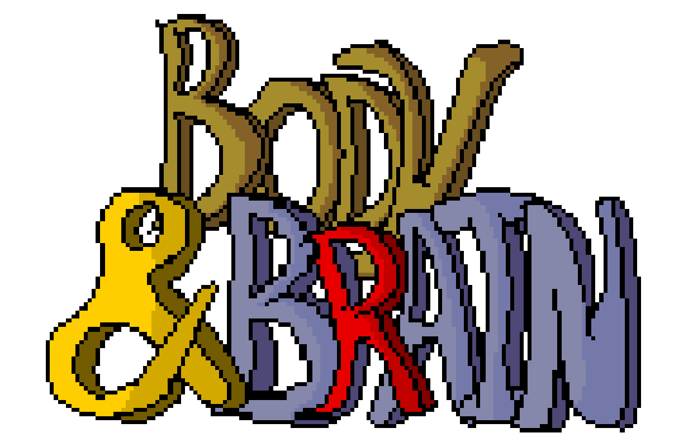

# Body And Brain - A Simple Role-Playing System

* [Body And Brain - A Simple Role-Playing System](#body-and-brain---a-simple-role-playing-system)
  * [Overview](#overview)
    * [System Focus](#system-focus)
    * [Character and Campaign Use](#character-and-campaign-use)
  * [Character Creation](#character-creation)
    * [Dice Notation](#dice-notation)
    * [Stats](#stats)
    * [Skill Level Bonus](#skill-level-bonus)
    * [Starting Skill Packages](#starting-skill-packages)
    * [Character Sheet Calculations](#character-sheet-calculations)
    * [Resistance Rolls](#resistance-rolls)
    * [Character Stats](#character-stats)
  * [Races](#races)
    * [Level And Life Stage](#level-and-life-stage)
    * [Age Influence On Stats](#age-influence-on-stats)
    * [Elf](#elf)
    * [Human](#human)
    * [Half-Elf](#half-elf)
    * [Dwarf](#dwarf)
    * [Halfling](#halfling)
    * [Reptilian](#reptilian)
    * [Feline](#feline)
    * [Orc](#orc)
  * [Professions](#professions)
    * [Fighter](#fighter)
    * [Berserker](#berserker)
    * [Paladin](#paladin)
    * [Ranger](#ranger)
    * [Rogue](#rogue)
    * [Bard](#bard)
    * [Wizard](#wizard)
    * [Conjuror](#conjuror)
    * [Cleric](#cleric)
  * [Adventuring](#adventuring)
    * [General Maneuvers](#general-maneuvers)
  * [Magic](#magic)
    * [Spell Lists](#spell-lists)
    * [Casting Procedure](#casting-procedure)
    * [Spell And Creature Terms](#spell-and-creature-terms)
    * [Blessings](#blessings)
    * [Body](#body)
    * [Curses](#curses)
    * [Destroy](#destroy)
    * [Leadership](#leadership)
    * [Mind](#mind)
    * [Naturalist](#naturalist)
    * [Necromancer](#necromancer)
    * [Songs](#songs)
    * [Summoning](#summoning)
  * [Combat](#combat)
    * [Combat Round](#combat-round)
    * [Physical Attacks](#physical-attacks)
    * [Spell Attacks](#spell-attacks)
  * [Non-Player Characters](#non-player-characters)
    * [NPC Generation](#npc-generation)
    * [NPC Level Significance](#npc-level-significance)
    * [NPC Stat Factors](#npc-stat-factors)
    * [NPC Skill Factors](#npc-skill-factors)
    * [NPC Stat Arrays](#npc-stat-arrays)
    * [NPC Hits](#npc-hits)
    * [Baseline Level 5 NPCs](#baseline-level-5-npcs)
    * [NPC Scaling Guidance By Profession](#npc-scaling-guidance-by-profession)
    * [Traditional Monster Level 5 Baselines](#traditional-monster-level-5-baselines)
    * [NPC Stat Block](#npc-stat-block)
    * [NPC Behavior](#npc-behavior)
  * [Items](#items)
    * [Weapon Examples](#weapon-examples)
    * [Armor Examples](#armor-examples)
    * [Travel Gear](#travel-gear)
  * [Apprenticeships](#apprenticeships)
    * [Bard Apprenticeships](#bard-apprenticeships)
    * [Berserker Apprenticeships](#berserker-apprenticeships)
    * [Cleric Apprenticeships](#cleric-apprenticeships)
    * [Conjuror Apprenticeships](#conjuror-apprenticeships)
    * [Fighter Apprenticeships](#fighter-apprenticeships)
    * [Paladin Apprenticeships](#paladin-apprenticeships)
    * [Ranger Apprenticeships](#ranger-apprenticeships)
    * [Rogue Apprenticeships](#rogue-apprenticeships)
    * [Wizard Apprenticeships](#wizard-apprenticeships)
  * [Appendices](#appendices)
    * [Fan Support](#fan-support)
    * [Licensing](#licensing)


## Overview

_____

Body and Brain (BaB) is a simple RPG system designed from the ground up to be suitable for both table-top play and computer play. BaB is created for new and experienced gamers alike, offering a slim set of rules that reduces the overhead of the gaming experience; thus, allowing new game masters to acclimate quickly and experienced game masters to keep their campaign moving.

Players of BaB benefit from a simple character sheet requiring little math to set up and get playing. Players get clear and concise instructions for creating, playing and leveling their character.

Creating game modules for BaB is a breeze due to simplified NPC selection and customization. Terrain effects are standardized for physical attack and maneuvers.

### System Focus

Body and Brain is organized around two linked halves of a character. Body covers Strength, Agility, and Constitution: the physical power, coordination, and endurance used for combat, travel, labor, and survival. Brain covers Intelligence, Presence, and Piety: the reasoning, will, social force, faith, and magical discipline used for knowledge, command, resistance, and spell work.

Most play should resolve quickly at the table. Choose the stat that matches the action, apply the relevant skill or resistance, roll the listed dice, and use the result table for the effect. The character sheet and canonical workbook carry the math so players can spend their attention on decisions rather than recalculating derived values.

### Character and Campaign Use

A player character starts with race, profession, apprenticeship, starting skill package, equipment, and any spell list granted by training. Those choices define what the character is already good at, while advancement grows the same Body and Brain structure without changing the core resolution method.

For game masters, the system keeps NPCs, monsters, terrain, armor, weapons, maneuvers, and spell effects in consistent tables. Canonical workbook values should be treated as the source for numerical baselines; this manual explains how to apply those values during play and marks any unresolved design gaps directly where they remain.


## Character Creation

_____

<!-- WORKBOOK-GENERATED:DICE-NOTATION:START -->

### Dice Notation

#### D10

A D10 is a ten-sided die that returns a result from 1 to 10. When a rule calls for multiple dice, roll each die and add the results. For example, `2D10` means roll two ten-sided dice and add them together.

Percentile-style rolls in Body and Brain are written as `D100` or described as a roll with a natural 1 or natural 100. Use a die labeled 1 to 100, or roll two D10s as tens and ones.

<!-- WORKBOOK-GENERATED:DICE-NOTATION:END -->

### Stats

The first step in generating a Body and Brain character is to make fourteen [D10](#d10) rolls, throw out the low and the high rolls, and sum the remaining rolls, giving you the player stat pool. Next, add the player stat pool to 400 to get your total stat pool. You may only have one stat of 100, one stat of 99, and two stats between 95 to 98. The rest of the stat pool may be allocated freely for stats of 94 and lower. A character may not earn more than 14 skill points per level for either the Body or Brain groups.

#### Selecting a [Profession](#professions)

The next step is to pick a Profession from *[Table 1-1](#table-1-1)*. Using the primary stat group (Body or Brain) as your guide, allocate your stat pool among the Body Stats:

* [Strength](#Strength)
* [Agility](#Agility)
* [Constitution](#Constitution)

and the Brain Stats:

* [Intelligence](#Intelligence)
* [Presence](#Presence)
* [Piety](#Piety)

###### Table 1-1

|Primary Stat|Profession
|:--|:--
|Presence|[Ranger](#Ranger)
|Presence|[Bard](#Bard)
|Constitution|[Fighter](#Fighter)
|Strength|[Berserker](#Berserker)
|Piety|[Paladin](#Paladin)
|Agility|[Rogue](#Rogue)
|Intelligence|[Wizard](#Wizard)
|Intelligence|[Conjuror](#Conjuror)
|Piety|[Cleric](#Cleric)

#### Selecting a [Race](#races)

The next step is to pick a Race from the Races available for your chosen profession (See *[Table 1-2](#table-1-2)*). After doing so, you enter the Racial Stat Bonuses for the individual stats (See *[Table 1-3](#table-1-3)*).

###### Table 1-2

|[Human](#Human)|[Half-Elf](#Half-Elf)|[Elf](#Elf)|[Dwarf](#Dwarf)|[Halfling](#Halfling)|[Reptilian](#Reptilian)|[Orc](#Orc)|[Feline](#Feline)
|:--|:--|:--|:--|:--|:--|:--|:--
|Bard|Bard|Bard|Berserker|Bard|Berserker|Fighter|Bard
|Berserker|Conjuror|Conjuror|Cleric|Cleric|Cleric|Berserker|Conjuror
|Cleric|Fighter|Ranger|Conjuror|Conjuror|Conjuror|Cleric|Ranger
|Conjuror|Ranger|Rogue|Fighter|Ranger|Fighter||Rogue
|Fighter|Rogue|Wizard|Paladin|Rogue|Paladin||Wizard
|Paladin|Wizard||Wizard|Wizard|Wizard||
|Ranger|||||||
|Rogue|||||||
|Wizard|||||||

###### Table 1-3

|Statistic|Human|Half-Elf|Elf|Dwarf|Halfling|Reptilian|Orc|Feline
|:--|:--|:--|:--|:--|:--|:--|:--|:--
|Strength|2|1|0|2|-1|2|3|-1
|Agility|1|2|3|-1|2|-1|0|3
|Constitution|1|1|0|2|0|1|2|0
|Intelligence|0|1|2|0|1|0|-3|0
|Presence|0|1|2|0|2|0|-1|3
|Piety|0|-2|-3|1|0|2|0|-1

#### Base Bonus

In addition to racial stat bonuses, stats also have an associated base bonus. *[Table 1-4](#table-1-4)* shows the bonus that an individual stat receives based on its value.

###### Table 1-4

|Range|Bonus
|:--|:-:
|1|-5
|2 to 10|-3
|11 to 25|-1
|26 to 49|0
|50 to 75|1
|76 to 89|2
|90 to 94|3
|95 to 98|4
|99|7
|100|10

#### Skills

Skills levels determine your effectiveness at using a specific skill. Skills are
broken down into seven sections:

* [Weapons](#Weapon-Skills)
* [Armor](#Armor-Skills)
* [Physical Skills](#Physical-Skills)
* [Mental Abilities](#Mental-Abilities)
* [Mixed Abilities](#Mixed-Abilities)
* [Arcane Skills](#Arcane-Skills)
* [Other Skills](#Other-Skills)

Skills are developed by spending skill points which are earned each level based on your stats. Using *[Table 1-5](#table-1-5),* assign skill points based on the stat value, keeping in mind that you may not exceed 14 skill points for either the Body or Brain group.

###### Table 1-5

|Range|Skill Points
|:--|--:
|1|0
|2 to 10|0
|11 to 25|0
|26 to 49|0
|50 to 75|1
|76 to 89|2
|90 to 94|3
|95 to 98|4
|99|5
|100|7

#### Weapon Skills

Developing weapon skills is performed by allocating skill points to skill levels. Using *[Table 1-6](#table-1-6)*, a Fighter can spend one skill point for one skill level for their Primary Melee or Primary Missile weapons. A fighter can then spend three skill points for one skill level for their Secondary Melee or Secondary Missile weapons. Our fighter’s Tertiary weapons require spending seven skill points for one skill level.

###### Table 1-6

|Primary Stat|Skill|Fighter|Berserker|Paladin|Ranger|Rogue|Bard|Wizard|Conjuror|Cleric
|:--|:--|:-:|:-:|:-:|:-:|:-:|:-:|:-:|:-:|:-:
|Strength|Primary Melee|1/3/7|1/3/7|1/3/7|2/5|2/5|2/5|7|5|2/5
|Agility|Primary Missile|1/3/7|2/5|2/5|1/3/7|2/5|3|5|10|4
|Strength|Secondary Melee|3/7|2/5|3/7|4|6|4|15|15|6
|Agility|Secondary Missile|3/7|4|5|2/5|6|6|10|20|12
|Strength|Tertiary Melee|7|4|7|10|11|12|20|40|10
|Agility|Tertiary Missile|7|9|10|4|11|14|20|40|20

<!-- WORKBOOK-GENERATED:WEAPON-TRAINING-TERMS:START -->

#### Primary Melee

Primary Melee is the character's first and most efficient melee training category. If a race specifies a natural or required weapon for Primary Melee, that weapon occupies the Primary Melee slot. Feline claws are the Feline Primary Melee weapon, and they use Agility instead of Strength.

<!-- WORKBOOK-GENERATED:WEAPON-TRAINING-TERMS:END -->

#### Armor Skills

Armor is a bit simpler. The player can allocate skill points to specific armor types same as is done for weapons, but the skill points costs are fixed per armor type. Our fighter can thus allocate the number of skill points denoted in *[Table 1-7](#table-1-7)* for one skill level.

###### Table 1-7

|Primary Stat|Skill|Fighter|Berserker|Paladin|Ranger|Rogue|Bard|Wizard|Conjuror|Cleric
|:--|:--|:-:|:-:|:-:|:-:|:-:|:-:|:-:|:-:|:-:
|Agility|None or Light Clothing|1/3/5|1/3/5|1/3/5|1/3/5|1/3/5|1/3/5|3|2|1/3/5
|Agility|Robes|1/3/5|1/3/5|1/3/5|1/3/5|1/3/5|1/3/5|3|2|1/3/5
|Agility/Strength|Soft Leather|1/3/5|1/3/5|1/3/5|5|3/7|3/7|-|8|1/3/5
|Agility/Constitution|Rigid Leather|3/7|2/6|3/7|10|7|5|-|-|3
|Strength|Chain|5/10|4|5|-|-|10|-|-|5
|Strength/Constitution|Plate|7|-|7|-|-|-|-|-|7
|Strength|Helm|1|1|2|-|-|-|-|-|-
|Strength|Shield|1|-|1|-|-|4|-|-|1

#### Physical Skills

Physical Skills encompass actions that be taken by a character that primarily depend upon the Body stats of the character.

###### Table 1-8

|Primary Stat|Skill|Fighter|Berserker|Paladin|Ranger|Rogue|Bard|Wizard|Conjuror|Cleric
|:--|:--|:-:|:-:|:-:|:-:|:-:|:-:|:-:|:-:|:-:
|Agility|Sprint|3|2|3|2|2|3|8|6|5
|Constitution|Run|3|3|3|2|2|2|7|5|4
|Agility|Swim|3|5|5|1|2|3|10|7|7
|Strength|Climb|3|5|4|1|1|3|8|8|5
|Body|Body General|3|4|4|2|2|3|8|7|5

#### Mental Abilities

###### Table 1-9

|Skill Points Per Level|Skill|Fighter|Berserker|Paladin|Ranger|Rogue|Bard|Wizard|Conjuror|Cleric
|:--|:--|:-:|:-:|:-:|:-:|:-:|:-:|:-:|:-:|:-:
|Presence|Traps|8|20|10|2|1/3|3|5|3|4
|Intelligence|Locks|8|20|10|4|1/3|3|5|3|4
|Presence/Piety|Persuasion|8|15|3|4|3|1/3|2|4|1
|Intelligence|Item Lore|10|15|7|10|1/3|2|1/3|1/3|3
|Intelligence|Read Runes|10||4|5|3|2|1/3|2|2
|Presence|Use Item|7|15|4|5|3|1/3|2|1/3|2
|Mind|Brain General|8|17|8|5|2|3|4|3|3

#### Mixed Abilities

###### Table 1-10

|Primary Stat|Skill|Fighter|Berserker|Paladin|Ranger|Rogue|Bard|Wizard|Conjuror|Cleric
|:--|:--|:-:|:-:|:-:|:-:|:-:|:-:|:-:|:-:|:-:
|Agility/Presence|Stealing|7|10||4|1/3|3|7|6|
|Agility/Intelligence|Tracking|10|15|15|1/3|4|3|10|6|10
|Constitution/Presence|Hiding|8|10|10|1/3|1/3|3|8|6|8
|Agility/Presence|Balancing|6|5|7|2|1|3|5|5|5
|Mind/Body|Mixed General|8|10|10|3|2|3|8|6|8

#### Arcane Skills

###### Table 1-11

|Primary Stat|Skill|Fighter|Berserker|Paladin|Ranger|Rogue|Bard|Wizard|Conjuror|Cleric
|:--|:--|:-:|:-:|:-:|:-:|:-:|:-:|:-:|:-:|:-:
|Intelligence|Enchantment|40/-/-|-|-|40/-/-|40/-/-|7/12/20|1/3/7|7/-/-|-
|Presence|Conjuring|30/-/-|-|-|30/-/-|40/-/-|7/12/20|7/-/-|1/3/7|-
|Piety|Prayer|25/-/-|-|7/12/-|25/-/-|-|-|-|-|1/3/3
|Piety|Leadership|-|-|4/7/12|-|-|-|-|-|-
|Intelligence|Naturalist|-|-|-|4/7/12|-|-|-|-|-
|Presence|Songs|-|-|-|-|-|2/6/10|-|-|-

#### Other Skills

###### Table 1-12

|Primary Stat|Skill|Fighter|Berserker|Paladin|Ranger|Rogue|Bard|Wizard|Conjuror|Cleric
|:--|:--|:-:|:-:|:-:|:-:|:-:|:-:|:-:|:-:|:-:
|Presence|Perception|5|15|5|1|1|5|1|5|5
|Constitution|Body Development|2|1|4|5|7|6|25|15|4

### Skill Level Bonus

###### Table 1-13

|Skill Level|Bonus
|:-:|:-:
|0|-5
|1|5
|2|10
|3|15
|4|19
|5|23
|6|26
|7|29
|8|31
|9|33
|10|34

<!-- WORKBOOK-GENERATED:STARTING-SKILLS:START -->

### Starting Skill Packages

BodyAndBrain.xlsm defines the baseline skill levels granted by each profession before current-level spending is applied.

#### Primary Weapons

| Stat | Skill | Fighter | Berserker | Paladin | Ranger | Rogue | Bard | Wizard | Conjuror | Cleric |
| --- | --- | --- | --- | --- | --- | --- | --- | --- | --- | --- |
| Strength | Melee | 2 | 2 | 2 | 1 | 1 | 1 | 1 | 2 | 2 |
| Agility | Missile | 2 | 1 | 2 | 2 | 1 | 1 | 0 | 0 | 1 |

#### Secondary Weapons

| Stat | Skill | Fighter | Berserker | Paladin | Ranger | Rogue | Bard | Wizard | Conjuror | Cleric |
| --- | --- | --- | --- | --- | --- | --- | --- | --- | --- | --- |
| Strength | Melee | 1 | 2 | 1 | 0 | 0 | 1 | 0 | 0 | 2 |
| Agility | Missile | 1 | 1 | 1 | 1 | 0 | 0 | 0 | 0 | 0 |

#### Tertiary Weapons

| Stat | Skill | Fighter | Berserker | Paladin | Ranger | Rogue | Bard | Wizard | Conjuror | Cleric |
| --- | --- | --- | --- | --- | --- | --- | --- | --- | --- | --- |
| Strength | Melee | 1 | 0 | 0 | 0 | 0 | 0 | 0 | 0 | 0 |
| Agility | Missile | 1 | 0 | 0 | 0 | 0 | 0 | 0 | 0 | 0 |

#### Other

| Stat | Skill | Fighter | Berserker | Paladin | Ranger | Rogue | Bard | Wizard | Conjuror | Cleric |
| --- | --- | --- | --- | --- | --- | --- | --- | --- | --- | --- |
| Presence | Perception | 1 | 0 | 1 | 2 | 2 | 1 | 2 | 1 | 1 |
| Constitution | Body Development | 2 | 3 | 2 | 1 | 1 | 1 | 1 | 1 | 2 |

#### Physical Activities

| Stat | Skill | Fighter | Berserker | Paladin | Ranger | Rogue | Bard | Wizard | Conjuror | Cleric |
| --- | --- | --- | --- | --- | --- | --- | --- | --- | --- | --- |
| Agility | Sprinting | 1 | 2 | 1 | 2 | 2 | 1 | 1 | 1 | 1 |
| Constitution | Running | 1 | 1 | 1 | 2 | 1 | 1 | 1 | 1 | 1 |
| Agility | Swimming | 1 | 0 | 1 | 2 | 1 | 1 | 0 | 1 | 0 |
| Strength | Climbing | 1 | 1 | 1 | 2 | 2 | 1 | 0 | 1 | 0 |
| Body | General | 0 | 0 | 0 | 0 | 0 | 0 | 0 | 0 | 0 |

#### Mental Activities

| Stat | Skill | Fighter | Berserker | Paladin | Ranger | Rogue | Bard | Wizard | Conjuror | Cleric |
| --- | --- | --- | --- | --- | --- | --- | --- | --- | --- | --- |
| Presence | Traps | 0 | 0 | 0 | 1 | 2 | 1 | 0 | 0 | 0 |
| Intelligence | Locks | 0 | 0 | 0 | 0 | 2 | 1 | 0 | 0 | 0 |
| Presence/Piety | Persuasion | 0 | 0 | 1 | 1 | 1 | 1 | 1 | 1 | 2 |
| Intelligence | Item Lore | 0 | 0 | 0 | 0 | 2 | 1 | 1 | 1 | 1 |
| Mind | General | 0 | 0 | 0 | 0 | 0 | 0 | 0 | 0 | 0 |

#### Mixed Activities

| Stat | Skill | Fighter | Berserker | Paladin | Ranger | Rogue | Bard | Wizard | Conjuror | Cleric |
| --- | --- | --- | --- | --- | --- | --- | --- | --- | --- | --- |
| Agility/Presence | Stealing | 0 | 0 | - | 0 | 2 | 1 | 0 | 0 | - |
| Agility/Intelligence | Tracking | 0 | 0 | 0 | 2 | 0 | 1 | 0 | 0 | 0 |
| Constitution/Presence | Hiding | 1 | 0 | 0 | 2 | 2 | 1 | 1 | 1 | 0 |
| Agility/Presence | Balancing | 1 | 1 | 1 | 2 | 1 | 1 | 1 | 1 | 1 |
| Mind/Body | General | 0 | 0 | 0 | 0 | 0 | 0 | 0 | 0 | 0 |

#### Armor

| Stat | Skill | Fighter | Berserker | Paladin | Ranger | Rogue | Bard | Wizard | Conjuror | Cleric |
| --- | --- | --- | --- | --- | --- | --- | --- | --- | --- | --- |
| Agility | None/Light Clothing | 1 | 1 | 1 | 1 | 1 | 1 | 1 | 1 | 1 |
| Agility | Heavy Clothing/Robes | 1 | 1 | 1 | 1 | 1 | 1 | 1 | 1 | 1 |
| Agility/Strength | Soft Leather | 1 | 1 | 1 | 1 | 1 | 1 | - | 0 | 1 |
| Agility/Constitution | Rigid Leather | 1 | 1 | 1 | 0 | 1 | 1 | - | - | 1 |
| Strength | Chain | 1 | 0 | 1 | - | - | 0 | - | - | 0 |
| Strength/Constitution | Plate | 0 | - | 0 | - | - | - | - | - | 0 |
| Strength | Helm | 1 | 1 | 0 | - | - | - | - | - | - |
| Strength | Shield | 1 | - | 1 | - | - | 0 | - | - | 1 |

#### Arcane

| Stat | Skill | Fighter | Berserker | Paladin | Ranger | Rogue | Bard | Wizard | Conjuror | Cleric |
| --- | --- | --- | --- | --- | --- | --- | --- | --- | --- | --- |
| Intelligence | Read Runes | 0 | - | 0 | 0 | 3 | 2 | 1 | 2 | 2 |
| Presence | Use Item | 0 | 0 | 0 | 1 | 3 | 1 | 2 | 1 | 2 |
| Intelligence | Enchantment | 0 | - | - | 0 | 0 | 0 | 2 | 1 | - |
| Presence | Conjuring | 0 | - | - | 0 | 0 | 0 | 1 | 2 | - |
| Piety | Prayer | 0 | 0 | 0 | 0 | - | 0 | - | - | 3 |
| Piety | Leadership | - | - | 1 | - | - | - | - | - | - |
| Intelligence | Naturalist | - | - | - | 1 | - | - | - | - | - |
| Presence | Songs | - | - | - | - | - | 1 | - | - | - |

<!-- WORKBOOK-GENERATED:STARTING-SKILLS:END -->

<!-- WORKBOOK-GENERATED:CHARACTER-SHEET-CALCULATIONS:START -->

### Character Sheet Calculations

These rules are inferred from the visible labels and canonical worksheet tables in BodyAndBrain.xlsm.

Labels and visible canonical worksheet tables are treated as design intent. Formula, hidden-cell, or VBA variances are spreadsheet bugs and are not published as alternate rules.

| Calculation | Rule |
| --- | --- |
| Total stat pool | Rolled total + 400 |
| Available stat pool | Total stat pool minus assigned Strength, Agility, Constitution, Intelligence, Presence, and Piety values |
| Stat bonus | Base stat bonus plus racial stat bonus |
| Body bonus | Average of Strength, Agility, and Constitution total bonuses |
| Brain bonus | Average of Intelligence, Presence, and Piety total bonuses |
| Body skill points | Sum of Strength, Agility, and Constitution skill point values |
| Brain skill points | Sum of Intelligence, Presence, and Piety skill point values |
| Earned skill points | Current level multiplied by Body skill points plus Brain skill points |
| Resistance bonus | Base stat bonus plus race resistance bonus for the affliction |
| Skill level | This Level plus Base Line |
| Skill-level bonus | Skill level mapped through the Skill Level Bonus table |
| Skill bonus | Skill-level bonus plus governing stat bonus plus other modifiers |
| Slash-separated skill cost | `1/3/7` means first current-level increase costs 1, second costs 3, third costs 7, then no further increase is available from that cost string |

<!-- WORKBOOK-GENERATED:CHARACTER-SHEET-CALCULATIONS:END -->

<!-- WORKBOOK-GENERATED:RESISTANCE-ROLLS:START -->

### Resistance Rolls

Resistance rolls use the resistance bonus from the character sheet.

| Resistance | Governing Stat | Resistance Bonus |
| --- | --- | --- |
| Poison | Strength | Strength base bonus + racial Poison modifier |
| Disease | Constitution | Constitution base bonus + racial Disease modifier |
| Wizardry | Intelligence | Intelligence base bonus + racial Wizardry modifier |
| Conjuring | Presence | Presence base bonus + racial Conjuring modifier |
| Curses | Piety | Piety base bonus + racial Curses modifier |

Unless a spell or effect gives a different target number, roll `D100 + resistance bonus` and apply the following outcome.

| Roll + Bonus | Outcome |
| --- | --- |
| 1 (Natural) | Fumble: full effect, plus a GM complication |
| 2 to 25 | Failure: full effect |
| 26 to 49 | Partial Failure: full effect, but halve duration or recurring damage |
| 50 to 74 | Partial Success: halve immediate damage or reduce the condition by one step |
| 75 + | Success: resist the ongoing effect |
| 100 (Natural) | Astounding Success: resist the effect and gain +5 on the next resistance roll against the same source |

#### Poison

Poison is resisted with Strength. A poison effect should define its immediate damage, recurring damage, interval, and duration. If a poison lacks those details, use `1D4` damage per round for `1D4` rounds. A successful Poison resistance roll prevents the recurring effect; a partial result reduces the recurring damage or duration as described in [Resistance Rolls](#resistance-rolls). The Stop Poison spell ends active poison damage over time.

#### Disease

Disease is resisted with Constitution. Disease effects should define symptoms, interval, and recovery conditions. If a disease lacks those details, it imposes `-5` on Body activities after the first failed resistance roll and requires another Disease resistance roll after each rest period to recover. A successful Disease resistance roll prevents the disease from taking hold; a partial result delays the penalty until the next interval. The Stop Disease spell ends active disease effects.

#### Wizardry

Wizardry is resisted with Intelligence. Use Wizardry resistance against hostile effects from the Wizardry spell discipline when the spell changes the target's body, mind, location, or condition rather than simply making an attack roll. Direct damage still uses the spell attack rules first; Wizardry resistance applies only if the spell or GM calls for resisting the effect.

#### Conjuring

Conjuring is resisted with Presence. Use Conjuring resistance against hostile summoned, destructive, spirit, or energy effects from the Conjuring spell discipline when the spell imposes an ongoing condition or contests control. Direct damage still uses the spell attack rules first; Conjuring resistance applies only if the spell or GM calls for resisting the effect.

<!-- WORKBOOK-GENERATED:RESISTANCE-ROLLS:END -->

### Character Stats

Body and Brain uses six basic stats that describe a characters attributes that affect gameplay.

#### Body

There are three stats that define the Body category: [Strength](#Strength), [Agility](#Agility) and [Constitution](#Constitution).

##### Strength

Strength is the ability to apply physical force to an object.  Doing things like swinging a sword requires strength to move it.  Strength also is required to wear heavy armor. Marching headlong into battle with heavy weapons, the [Berserker](#Berserker) must be strong to swing those massive weapons with the force to kill their enemies quickly.

##### Agility

Agility is the ability to control your body.  Whether it's fine motor control picking locks, or aiming a bow, Agility allows the character to do these things effortlessly. [Rogues](#Rogue) use their Agility in nearly all things they do.

##### Constitution

Constitution is your body's resilience to stresses acting upon it.  The amount of damage you can take before going down and the ability to shoulder heavy loads for long periods of time are determined by a character's Constitution. As the tough guys of the world of Body and Brain, [Fighters](#Fighter) depend greatly on their constitution to wear heavy armor and keep in the fight.

#### Brain

There are three stats that define the Brain category: [Intelligence](#Intelligence), [Presence](#Presence) and [Piety](#Piety).

##### Intelligence

Intelligence is the measure of a character's ability to gain and retain knowledge, and then recall that knowledge and apply it to an action such as casting a spell or reading a scroll during combat.  Of all the classes, [Wizards](#Wizard) and [Conjurors](#Conjuror) are the most dependent on Intelligence.

##### Presence

Presence is both the character's ability to perceive the world around him and to project himself into that world.  A [Bard](#Bard) depends on his presence to react to others as well as influence them. [Rangers](#Ranger) depend on Presence to help them be aware of their quarry and know when the tables have been turned.

##### Piety

Piety is the connection that a character has to his patron Gods.  [Clerics](#Cleric) and [Paladins](#Paladin) draw upon this Piety to curry favor that is called upon to support the party through healing and calm, as well as to be especially fierce when fighting the [Undead](#undead).


## Races

_____

Body and Brain is built around normal fantasy races, but that does not mean we need to stop there!  You are encouraged to create and add more races to the Appendices.

### Level And Life Stage

For each race, character level also represents social and physical maturity. Long-lived or short-lived races may reach these stages at different calendar ages, but the level bands have the same play meaning for all races.

| Level | Life Stage | Meaning |
| --- | --- | --- |
| 1 | Apprentice / Adolescent | The character is still learning a trade, profession, faith, craft, or survival role under direct or recent guidance. |
| 2 to 4 | Young Adult | The character is independent enough to adventure, but still forming adult judgment, reputation, and professional habits. |
| 5 to 7 | Adult | The character is a fully capable adult member of their race and profession. Level 5 is the baseline adult used by quick NPC generation. |
| 8 to 10 | Experienced Adult | The character is a seasoned adult whose ability, judgment, and reputation stand above ordinary adults. |

### Age Influence On Stats

Life stage modifies stat scores after racial stat bonuses and before stat bonuses are derived. Adolescents are physically and mentally immature. Body stats peak in young adulthood, then trend downward as the character ages. Brain stats improve over working life as experience, wisdom, and applied intelligence develop. Apply Body adjustments to Strength, Agility, and Constitution. Apply Brain adjustments to Intelligence, Presence, and Piety. Clamp final stat scores to the normal 1 to 100 range.

| Level | Life Stage | Body Stat Adjustment | Brain Stat Adjustment | Meaning |
| --- | --- | --- | --- | --- |
| 1 | Apprentice / Adolescent | -10 | -10 | Not yet physically or mentally mature. |
| 2 to 4 | Young Adult | +5 | -5 | Peak raw physical development, but limited experience and judgment. |
| 5 to 7 | Adult | 0 | 0 | Baseline mature adult. |
| 8 to 10 | Experienced Adult | -5 | +5 | Physical prime has begun to fade, but experience, judgment, and discipline improve Brain stats. |

### Elf

Elves are the oldest race in Body and Brain, and are practically immortal.  No Elf has ever died of old age and very few have died of disease. Combat and poison, on the other hand, have claimed many Elves over the millennia.

Elves are very intelligent, perceptive and wise.  They have a great presence about them and the more gregarious of them tend to be [Bards](#Bard), with many specializing in [acting](#actor) while others with a more adventurous side going into [fencing](#Fencing) or [politics](#politician).

Elves are slight of frame, but are not impeded in the arena of [Strength](#Strength), and are especially agile.  Their combination of [Agility](#Agility), [Presence](#Presence) and [Intelligence](#Intelligence) makes them excellent [Rangers](#Ranger) and [Rogues](#Rogue).  [Piety](#Piety) is the Elf's Achilles Heel since they consider themselves akin to the Gods and are not very modest about it, which means that Elves cannot be [Paladins](#Paladin) or [Clerics](#Cleric).

#### [Professions](#professions) Available to Elves

* [Bard](#Bard)
* [Conjuror](#Conjuror)
* [Ranger](#Ranger)
* [Rogue](#Rogue)
* [Wizard](#Wizard)

#### Stat Bonuses for Elves

|Stat|Bonus
|:--|:-:
|[Strength](#Strength)|0
|[Agility](#Agility)|3
|[Constitution](#Constitution)|0
|[Intelligence](#Intelligence)|2
|[Presence](#Presence)|2
|[Piety](#Piety)|-3

#### Resistances for Elves

|Affliction|Elf
|:--|:--
|[Poison](#Poison)|1
|[Disease](#Disease)|2
|[Wizardry](#Wizardry)|0
|[Conjuring](#Conjuring)|0
|[Curses](#Curses)|-2

### Human

Humans arose a long time after the [Elves](#Elf).  As their numbers grew, they became jealous of the Elves' long lifespan, and that jealousy led to many wars between the two races.  Humans are more well rounded than Elves, displaying excellent [Strength](#Strength), [Constitution](#Constitution) and [Agility](#Agility), all of which serve them well as the jack-of-all trades in Body and Brain.  Humans can excel at all of the [professions](#professions) equally well.

#### [Professions](#professions) Available to Humans

* [Bard](#Bard)
* [Berserker](#Berserker)
* [Cleric](#Cleric)
* [Conjuror](#Conjuror)
* [Fighter](#Fighter)
* [Paladin](#Paladin)
* [Ranger](#Ranger)
* [Rogue](#Rogue)
* [Wizard](#Wizard)

#### Stat Bonuses for Humans

|Statistic|Bonus
|:--|:-:
|Strength|2
|Agility|1
|Constitution|1
|Intelligence|0
|Presence|0
|Piety|0

#### Resistances for Humans

|Affliction|Human
|:--|:--
|Poison|0
|Disease|1
|Wizardry|0
|Conjuring|0
|Curses|0

### Half-Elf

In between the wars between the [Humans](#Human) and [Elves](#Elf) there were many "encounters" between them.  Humans looking to have children with long lifespans to ensure the longevity of their line began enslaving Elven females and mating with them.  This became such a common practice that there were enough Half-Elves that they started to mate among themselves and eventually forming their own communities.

Being more well rounded than either Humans or Elves, they found themselves being able to build more balanced armies and thus gaining advantages over both the Humans and the Elves.  Soon they were pushing both out of the lands between the Human and Elven home lands.

#### [Professions](#professions) Available to Half-Elves

* [Bard](#Bard)
* [Conjuror](#Conjuror)
* [Fighter](#Fighter)
* [Ranger](#Ranger)
* [Rogue](#Rogue)
* [Wizard](#Wizard)

#### Stat Bonuses for Half-Elves

|Statistic|Half-Elf
|:--|:-:
|Strength|1
|Agility|2
|Constitution|1
|Intelligence|1
|Presence|1
|Piety|-2

#### Resistances for Half-Elves

|Affliction|Half-Elves
|:--|:--
|Poison|1
|Disease|1
|Wizardry|0
|Conjuring|0
|Curses|-1

### Dwarf

Many ages ago, a race was created by a God of the Mountains that would embrace the God's love of the deep places of the world.  They would have to be adapted well to living in cramped quarters and handling heavy loads.

That race is the Dwarves.  They have very high [Strength](#Strength) and [Constitution](#Constitution), perfect for living underground.  Additionally, they also have a strong connection to their God, making them the fiercest Paladins because of their strong [Piety](#Piety).  Seeing hosts of Dwarven Paladins in full armor is very frightening, whether friend or foe.

#### [Professions](#professions) Available to Dwarves

* [Berserker](#Berserker)
* [Cleric](#Cleric)
* [Fighter](#Fighter)
* [Paladin](#Paladin)
* [Wizard](#Wizard)

#### Stat Bonuses for Dwarves

|Statistic|Dwarves
|:--|:-:
|Strength|2
|Agility|-1
|Constitution|2
|Intelligence|0
|Presence|0
|Piety|1

#### Resistances for Dwarves

|Affliction|Dwarves
|:--|:--
|Poison|2
|Disease|1
|Wizardry|-1
|Conjuring|0
|Curses|-1

### Halfling

At the same time as creation of the [Dwarves](#Dwarf), another God who loves all things that are beautiful and green created a race that is well suited to the rolling hills and forest that they inhabit.  To aid their ability to live among the trees, they are small, light and very nimble.  Their stature of adults rarely reaching three feet tall has led to their being named Halflings.

Excelling at living among the trees, their [Agility](#Agility) is legendary.  Don't get into a dart throwing contest with a Halfling, you _will_ lose!  Living among the critters of the forest, and also being small, requires an acute sense of your surroundings which drives their excellent [Presence](#Presence) bonus.  Halflings are adept at building homes to their scale that cut into the hills surrounding the nearby forests.  These homes are well camouflaged from outside threats, often being overlooked unless the door is found.  This kind of architecture requires a keen mind, thus explaining their [Intelligence](#Intelligence) bonus.

#### [Professions](#professions) Available to Halflings

* [Bard](#Bard)
* [Cleric](#Cleric)
* [Conjuror](#Conjuror)
* [Ranger](#Ranger)
* [Rogue](#Rogue)
* [Wizard](#Wizard)

#### Stat Bonuses for Halflings

|Statistic|Halflings
|:--|:-:
|Strength|-1
|Agility|2
|Constitution|0
|Intelligence|1
|Presence|2
|Piety|0

#### Resistances for Halflings

|Affliction|Halflings
|:--|:--
|Poison|0
|Disease|0
|Wizardry|0
|Conjuring|0
|Curses|1

### Reptilian

Few creatures thrive in lakes, marshes and swamps, so Reptilians are one of two races, along with [Felines](#Feline) that evolved naturally.  As such they are most well adapted to their surroundings than any other race.  The are capable of very fast bursts of muscle twitch, lending them great [Strength](#Strength), but being cold blooded, their [Agility](#Agility) is less acute than other races.  Their [Constitution](#Constitution) is above average, but they are susceptible to [Cold  Attacks](#cold).

Reptilians, being naturally evolved, have a keen sense of their purpose in the world around them.  They are the only race to seek out the meaning of life itself, and that has led them to the highest [Piety](#Piety) as their studious lives have given them insight into all of the Gods and they draw strength from each as necessary, making them excellent [Clerics](#Cleric) and [Paladins](#Paladin).

#### [Professions](#professions) Available to Reptilians

* [Berserker](#Berserker)
* [Cleric](#Cleric)
* [Conjuror](#Conjuror)
* [Fighter](#Fighter)
* [Paladin](#Paladin)
* [Wizard](#Wizard)

#### Stat Bonuses for Reptilians

|Statistic|Reptilians
|:--|:-:
|Strength|2
|Agility|-1
|Constitution|0
|Intelligence|1
|Presence|0
|Piety|2

#### Resistances for Reptilians

|Affliction|Reptilians
|:--|:--
|Poison|1
|Disease|2
|Wizardry|-2
|Conjuring|0
|Curses|0

### Feline

Intimidation and speed are the best friends of the Feline race.  Felines are also very vain due to their very high [Presence](#Presence), often becoming actors or musicians (and being very good at both).  But on the battlefield they are a force to be reckoned with.  There are no better archers and when in hand to hand combat they can fight with their [Claws](#claws) as an equivalent to a [Short Sword](#short-sword).  Their fur is also natural armor, providing them the equivalent to [Soft Leather](#soft-leather).  Feline [Bards](#Bard) are capable of wreaking havoc on the battlefield as they joyfully sing [Battle Songs](#Songs) to aid the fight while slashing their opponents.  Felines must develop their claws as their [Primary Melee](#primary-melee) weapon, but their bonus stat is [Agility](#Agility) instead of [Strength](#Strength) for that skill.

The trait of the Felines that makes their armies so formidable is that when their Bards sing in unison, it double the area of effect of their spells and doubles any modifier roll for that song.

#### [Professions](#professions) Available to Felines

* [Bard](#Bard)
* [Conjuror](#Conjuror)
* [Ranger](#Ranger)
* [Rogue](#Rogue)
* [Wizard](#Wizard)

#### Stat Bonuses for Felines

|Statistic|Felines
|:--|:-:
|Strength|-1
|Agility|3
|Constitution|0
|Intelligence|0
|Presence|3
|Piety|-1

#### Resistances for Felines

|Affliction|Felines
|:--|:--
|Poison|0
|Disease|0
|Wizardry|1
|Conjuring|0
|Curses|0

### Orc

The God who made the [Dwarves](#Dwarf) has an evil little brother who was always jealous of him.  He hated his brother's creation and captured many Dwarves and mutilated and twisted them with dark magic to create Orcs. The Orcs have the most imposing stature, despite their relatively short size (the same as a Dwarf).  The Orcs are immensely strong and sturdy, boasting the highest [Strength](#Strength) and [Constitution](#Constitution).

During their mutation to Orcs, most of the Dwarves went mad, thus demolishing their ability to think rationally and thus greatly impeding their [Intelligence](#Intelligence), forcing them to rely on their under-developed [Presence](#Presence) to guide their actions, which are usually fool-hardy -- and they are very gullible.  But woe to the individual who makes one mad!  Where the [Felines](#Feline) rule the battlefield as [Bards](#Bard), an Orcish [Berserker](#Berserker) has no equal in hand-to-hand combat, wielding two axes with no penalties.  Additionally, when not wearing armor, Orcs take damage as if wearing [Rigid Leather](#rigid-leather) due to their high Constitution.  Finally, Orc Berserkers get a +5 to-hit bonus when when in hand-to-hand combat with a Dwarf.

#### [Professions](#professions) Available to Orcs

* [Berserker](#Berserker)
* [Fighter](#Fighter)
* [Cleric](#Cleric)

#### Stat Bonuses for Orcs

|Statistic|Orcs
|:--|:-:
|Strength|3
|Agility|0
|Constitution|2
|Intelligence|-3
|Presence|-1
|Piety|0

#### Resistances for Orcs

|Affliction|Orcs
|:--|:--
|Poison|2
|Disease|2
|Wizardry|-2
|Conjuring|-1
|Curses|0


## Professions

_____

Player classes are the second most important aspect of a character after its [Race](#Races).

> __A Word About Apprenticeships__
>
> Apprenticeships are a fundamental part of Body and Brain.  They are not only templates for starting a character, but they reflect the types of experiences that a character has had over their young life.  This is one area of Body and Brain that we really need your creativity and submissions.  The apprenticeships will be kept in a separate document structure organized by profession to make it easier for players to contribute.

### Fighter

Master of the sword and shield, armor and helm, when it comes to melee, the Fighter has it all.  No other class can study more armor and weapons than a Fighter.  The [Berserker](#Berserker) may deal more damage on the battle field, but the fighter can be more versatile and precise in their tactics, ultimately extending their longevity (and usefulness) in protracted engagements.
Most of the [races](#Races) can be a fighter.  Fighters draw upon their [Constitution](#Constitution) to wear heavy armor and absorb damage during combat.  High [Strength](#Strength) for melee weapons, or [Agility](#Agility) for missile weapons are a must for a fighter.  Fighters may also be cerebral, having the ability to study the mystic arts.

__Class Bonus__

Groups of two or more fighters equipped with full shields can form a wall that adds 25 points to each participants' defensive bonus and provides cover for party members behind them.

[__Available Apprenticeships__](#fighter-apprenticeships)

* [Soldier](#soldier)
* [Squire](#squire)

### Berserker

Want to be scared?  Want to be very, very scared?  Make a Berserker angry at you.  Go ahead, try it.  If you live to tell the tale then what a tale you could tell!  No other combatants are so ferocious during a fight among small parties where the Berserker can isolate a foe and have at them.  But that ferocity is a liability during larger or longer engagements where the Berserker themselves can be targeted for elimination early on.  A fleet footed [Ranger](#Ranger) can be especially vexing for a Berserker.    [Strength](#Strength) is the primary stat for the Berserker, and choosing to dump stat points into [Constitution](#Constitution) can help the Berserker to survive longer encounters.

__Class Bonus__

Berserkers wielding dual battle-axes roll twice for both hit and damage, taking the better of the hit rolls and the sum of the damages rolls.

[__Available Apprenticeships__](#berserker-apprenticeships)

* [Lycanthropy](#lycanthropy)
* [Wrestling](#wrestling)

### Paladin

Paladins bring their God with them to the Battlefield.  Nearly as adept with weapons as a [Fighter](#Fighter), the Paladin can front-line any army.  Their Gods show them their favor during their travels and during their fights, favors they call upon by praying.  Paladins draw on their [Piety](#Piety) to strengthen their bond to their God.  Being warriors wearing heavy armor, [Constitution] makes for a great choice of secondary stat to focus on, and having high [Strength](#Strength) helps as well.

__Class Bonus__

Paladins may pray during combat without taking a turn to do so.

[__Available Apprenticeships__](#paladin-apprenticeships)

* [Knight](#knight)

### Ranger

Stealthy, perceptive and a very deadly shot, Rangers are great assets in the wild.  Rangers can track the smallest and largest of creatures that don't fly, and are also adept at finding the nests of the ones that do.  In combat, Rangers have no equal with a bow, drawing upon their strong [Presence](#Presence) to locate their target and [Agility](#Agility) to accurately aim at it.

__Class Bonus__

Rangers gain an extra attack with a short bow for every four levels of advancement, up to level 16 at which they may let loose five arrows in a round.

[__Available Apprenticeships__](#ranger-apprenticeships)

* [Animist](#animist)
* [Tracker](#tracker)

### Rogue

Lock-picking is equal parts skill and luck, and Rogues have both.  They also pride themselves in their item lore knowledge which surpasses that of a [Wizard](#Wizard).  Rogues are remarkably stealthy in urban areas where they can hide in plain sight by acting natural for the surroundings.  The life of a rogue is full of adventure with many opportunities to pick pockets, plant evidence, spy on targets and avoid the authorities.  Rogues are not good front-line fighters but are well equipped for any task requiring a dagger or short bow.

__Class Bonus__

Rogues wearing normal attire for a region may hide in urban areas without failure, even when being sought.  They may not have any exposed armor or weapons when doing so.

[__Available Apprenticeships__](#rogue-apprenticeships)

* [Burglar](#burglar)
* [Pick Pocket](#pick-pocket)

### Bard

"Let me sing to you the tale of my travels, for amazed you will be by the acts of thee!"  Never ones to pass on an opportunity to sing songs of glory (especially ones concerning themselves), Bards are actually quite adept at living up to their epic tales of daring-do.  Properly outfitted for the task, Bards are very effective at all forms of combat.  Bards may sing while fighting to enhance their prowess or weaken their foes.  But away from the battle-field, the Bard is extremely versatile, and paired up with a [Rogue](#Rogue) they can create a small crime wave that the authorities may never solve!  Bards are especially adept at distraction making the Rogue's job all-to-easy.  A Bard lies or dies by their [Presence](#Presence).

__Class Bonus__

Once a day a Bard can influence a person's decision in his favor without rolling.

[__Available Apprenticeships__](#bard-apprenticeships)

* [Actor](#actor)
* [Fencing](#fencing)
* [Politician](#politician)

### Wizard

If your Wizard yells, "Fire in the hole" it is time to run towards him (unless a [Berserker](#Berserker) is chasing you, in which case just run anywhere)!  Damage, and lots of it, is the forte of the Wizard.  Wizards draw upon the energy of the universe to create effects both real and imagined.  But this is no task for the unintelligent as the Wizard depends on their primary stat ([Intelligence](#Intelligence)) more than any other class.  Wizards are experts at identifying and using non-religious relics of all types.  With a powerful spell book and fire in their eyes, great Wizards dominate great battles.

__Class Bonus__

Wizards are able to analyze an unknown scroll and cast a spell from it at normal effectiveness in a single turn.

[__Available Apprenticeships__](#wizard-apprenticeships)

* [Alchemy](#alchemy)
* [Scholarship](#scholarship)

### Conjuror

Conjurors make things go bump in the night.  Snarling, spooky or spectral, they summon them from the energy and spirits around them.  Conjurors are rarely seen without a summoned pet that can aid them in any scenario natural to the pet, even having the ability to see with the pet's eyes.  Conjurors can also cast spells that influence the energy around various targets, helping or harming them consistent with the targets attitude towards the caster.  Conjurors can be a hardy outdoorsman, able to cast their spells wearing up to soft-leather armor.  Sorcerers can also become proficient with melee combat with staves and spears, fighting side-by-side with their summoned pet.  As with the [Wizard](#Wizard), the Conjuror relies heavily on their [Intelligence](#Intelligence) with the more hands-on types needing [Strength](#Strength) for fighting or the more adventurous needing [Agility](#Agility) to aid with more acrobatic skills.

__Class Bonus__

Once a day the Conjuror can transform himself into one of the pets he is able to summon at his current level.  The Conjuror will not lose control over any controlled pets.  The transformation lasts no longer than 24 hours and the Conjuror can break the spell at any time.  The conjuror will fight at the level of the same summoned pet and does not gain combat experience while not in human form.

[__Available Apprenticeships__](#conjuror-apprenticeships)

* [Illusions](#illusions)
* [Necromancy](#necromancy)

### Cleric

With the ability to smite physically and metaphysically, Clerics can be front-line warriors with the ability to heal downed party members quickly on the battle-field by praying to their patron God so long as their God's sigil or totem is displayed to the world on the Cleric's body.  Clerics may use any armor and a shield, but a helm cannot be worn when praying. Like the [Paladin](#Paladin), Clerics draw upon their [Piety](#Piety) to curry favor with their patron God.

__Class Bonus__

Once per week a Cleric may spend 60 uninterrupted minutes praying over a dead follower of the same God and bring them back to life with one temporary point of stat loss across all stats for each three hours since death starting after the first 10 minutes after death.  If the deceased follows a different God of the same alignment, then the Cleric must pray for three uninterrupted hours and the recipient receives one _permanent_ point of stat loss of their class's main stat, and two temporary stat points across all other stats.

[__Available Apprenticeships__](#cleric-apprenticeships)

* [Monk](#monk)
* [Priesthood](#priesthood)
* [Undead Hunter](#undead-hunter)


## Adventuring

_____

### General Maneuvers

General maneuvers use a roll plus the relevant skill bonus, then apply situational penalties from the calculation table.

| Calculation | Modifier |
| --- | --- |
| Add | Maneuver Skill |
| Add | Item Bonus |
| Add | Spell Bonus |
| Add | Other Bonuses |
| Subtract | Current HP < 50%: 5 |
| Subtract | Current HP < 25%: 10 |
| Subtract | Stunned: 15 |
| Subtract | Bleeding Per Round |

#### Physical Maneuver Outcomes

| Roll + Bonus | Outcome | Running | Swimming | Climbing | General |
| --- | --- | --- | --- | --- | --- |
| 1 (Natural) | Fumble | Trip and Break Limb  -15 hits | Unconsious -3 Hits/round | Fall and Break Limb -15 hits | GM Discretion |
| 2 to 25 | Failure | Trip | Sink -1 Hits/round | Fall + 5 hits | GM Discretion |
| 26 to 49 | Partial Failure | Stumble | Water in Nose -5 Hits | Slip 5' Down | GM Discretion |
| 50 to 74 | Partial Success | Jog | Sloppy | No Progress | GM Discretion |
| 75 + | Success | Run | Swim | Climb | GM Discretion |
| 100 (Natural) | Astounding Success | Sprint Endurance as if Running | Sprint Endurance as if Swimming | Double Climb Rate Endurance as if Climbing | GM Discretion |

#### Mental Maneuver Outcomes

| Roll + Bonus | Outcome | Traps | Locks | Persuasion | Item Lore | General |
| --- | --- | --- | --- | --- | --- | --- |
| 1 (Natural) | Fumble | Trap Springs and Pieces Lodge in Eye  -15 Hits | Pick Breaks and Lodges in Lock | Target is so offended that they punch you in nose -5 Hits | Identify as Wrong Item - May not try again for 1 day | GM Discretion |
| 2 to 25 | Failure | Trap Springs | Pick Breaks | Target is offended | Learn Nothing | GM Discretion |
| 26 to 49 | Partial Failure | Trap Doesn't Release | Cannot Solve Lock | Target is confused | Gleans Some Info | GM Discretion |
| 50 to 74 | Partial Success | Trap Solved, but not disarmed | Lock Solved, but not opened | Target understands concept | Determine Materials | GM Discretion |
| 75 + | Success | Trap disarmed | Lock Opened | Target persuaded | Item Identified | GM Discretion |
| 100 (Natural) | Astounding Success | All Traps of this Type automatically disarmed for 1 day | All Locks of this Type automatically Opened for 1 day | Target inspired to do extra +5 next action | Item Origin Determined | GM Discretion |

#### Mixed Maneuver Outcomes

The mixed maneuver table uses the same roll bands as the physical and mental maneuver tables. The Balancing astounding success result is completed as a best-fit rule: the character crosses the obstacle at normal speed without another Balancing roll that round.

| Roll + Bonus | Outcome | Stealing | Tracking | Hiding | Balancing | General |
| --- | --- | --- | --- | --- | --- | --- |
| 1 (Natural) | Fumble | Caught Red Handed - Incarcerated | Contaminated Tracks | Sneeze and are singled out where you are. | Fall and break limb | GM Discretion |
| 2 to 25 | Failure | Target got away | Lost Track Permanently | Seen | Fall | GM Discretion |
| 26 to 49 | Partial Failure | Item not stolen | Lost track temporarily | Noticed | Hang on for dear life | GM Discretion |
| 50 to 74 | Partial Success | Item still in reach | Briefly lost track | Motion Detected | Stumble | GM Discretion |
| 75 + | Success | Item stolen | Found Track | Hidden | Balance | GM Discretion |
| 100 (Natural) | Astounding Success | Got away Scott Free +15 next action | Sneak up on Target +20 ambushing this Target | Sneak up on Target +20 ambushing this Target | Run across the obstacle at normal speed without another Balancing roll this round | GM Discretion |


## Magic

_____

Magic is organized into spell lists. Each spell list has a discipline, a governing stat, and restrictions or required foci from the canonical workbook.

### Spell Lists

| Discipline | Stat | Spell List | Spell Count | Restrictions / Focus |
| --- | --- | --- | --- | --- |
| Wizardry | Intelligence | Body | 8 | No Armor, No Helms, No Shields, Staff |
| Wizardry | Presence | Mind | 7 | No Armor, No Helms, No Shields, Staff |
| Conjuring | Intelligence | Summoning | 8 | No Metal, No Helms, No Shields, Totem |
| Conjuring | Presence | Destroy | 7 | No Metal, No Helms, No Shields, Totem |
| Prayers | Piety | Blessings | 8 | No Helms, Sigil |
| Prayers | Piety | Curses | 7 | No Helms, Sigil |
| Paladin | Piety | Leadership | 5 | Sigil |
| Ranger | Intelligence | Naturalist | 5 | No Metal, No Helms, No Shields, Totem |
| Bard | Presence | Songs | 7 | No Helms, No Shields, Instrument |
| Conjuring | Intelligence | Necromancer | 8 | No Metal, No Helms, No Shields, Totem, Necromancy Apprenticeship |

### Casting Procedure

A caster may cast a spell they know when their character level is equal to or greater than the spell level and they have access to that spell list through profession, apprenticeship, or another explicit rule. The caster must obey the spell list restrictions and have any required focus ready: Staff, Totem, Sigil, or Instrument.

Casting normally uses the caster's action for the round. Self spells take effect on the caster. Directed, splash, and area spells use the spell attack rules when the target resists by position, armor, or impact. If a spell imposes an ongoing condition, control effect, poison, disease, curse, or similar continuing harm, the target may also make the appropriate resistance roll when the spell description or GM calls for it.

Body and Brain does not use spell slots in the canonical workbook. The limiting factors are known spell level, action time, gear restrictions, focus requirements, range, duration, and the risk of attack or interruption. A caster who is stunned, incapacitated, bound, silenced, or deprived of a required focus cannot cast unless the spell or GM explicitly allows it.

When a spell list names an apprenticeship as a requirement, only characters with that apprenticeship have access to that list. The Necromancer list is available only to Conjurors who chose the Necromancy apprenticeship.

Spells with `Immediate` duration resolve at once. Spells with a timed duration continue for the listed time. Songs last while the Bard keeps playing unless the spell says otherwise; the Bard cannot use another action that would stop the performance without ending the song.

### Spell And Creature Terms

#### Undead

Undead are creatures animated by death, curse, spirit, or necromantic force. They count as undead for Turn Undead, Bless, Curse, and any other rule that names undead. Undead do not suffer poison or disease unless the GM defines a specific exception. Healing effects that restore living flesh do not restore undead unless the effect says otherwise.

### Blessings

| Level | Name | Type | Targets | Range | Area | Modifier | Duration | Description |
| --- | --- | --- | --- | --- | --- | --- | --- | --- |
| 1 | Stop Bleeding | Directed | 1 | Touch | - | - | Immediate | Stops any bleeding |
| 3 | Turn Undead | Directed | Area | 25+Level | 2D4 | 1D6 per 5 Levels | Immediate | Damages undead in area |
| 5 | Stop Poison | Directed | 1 | Touch | - | - | Immediate | Stops all poison DoT |
| 7 | Heal | Directed | 1 | 1/Level | - | 1D6 per 5 Levels | Immediate | Heals and stops bleeding |
| 9 | Stop Disease | Directed | 1 | Touch | - | - | Immediate | Stops all disease effects for caster and target |
| 12 | Bless | Directed | Area | 25+Level | 2D4 | - | 10s/Level | Targets gain +15 to all attacks (+30 against undead) |
| 20 | Remove Curse | Directed | 1 | Touch | - | - | Immediate | Removes all curses |
| 50 | Revive Dead | Directed | 1 | Touch | - | - | Immediate | Revives being up to 1/5 level of caster |

### Body

| Level | Name | Type | Targets | Range | Area | Modifier | Duration | Description |
| --- | --- | --- | --- | --- | --- | --- | --- | --- |
| 1 | Nauseate | Directed | Area | 15 + Level | 3+Level | 1D4/target | 30 seconds | A nauseating gas erupts in an area |
| 3 | Bolts | Directed | 1 | 15 + Level | - | 1D10 | Immediate | A bolt (type decided by caster) directed at a single target |
| 5 | Hasten | Self | Area | Self | 5 per 5 Levels | - | 5 minutes | +15 bonus to all actions |
| 7 | Blasts | Directed | Area | 25 + Level | 1/Level | 1D8/target | Immediate | A blast (type decided by caster) explodes at a location |
| 9 | Crush | Directed | 1 | 15 + Level | - | 2D10 | Immediate | Target is crushed |
| 12 | Displace | Directed | 1 | 25 + Level | - | - | Immediate | Single target within Range moved anywhere within same Range |
| 20 | Break Bonds | Self | - | - | - | - | Immediate | All bindings (physical or magical) are broken |
| 50 | Disintegration | Directed | 1 | 1/Level | - | - | Immediate | Target is immediately disintegrated |

### Curses

| Level | Name | Type | Targets | Range | Area | Modifier | Duration | Description |
| --- | --- | --- | --- | --- | --- | --- | --- | --- |
| 2 | Weaken | Directed | 1 | 20+Level | - | 1D4 per 5 Levels | 1D6 per 5 Levels | Reduces Body bonuses by modifier |
| 4 | Cause Fear | Directed | Area | 20+Level | 2D4 | - | 1D6 per 5 Levels | Target cannot attack for duration of spell |
| 6 | Cause Bleeding | Directed | 1 | 20+Level | - | 1D8 per 10 Levels | 1D6 per 5 Levels | Target takes damage for duration of spell |
| 8 | Remove Blessing | Directed | Area | 20+Level | 2D4 | - | Immediate | All blessing are removed |
| 10 | Harm | Directed | 1 | 20+Level | - | 1D10 per 5 Levels | Immediate | Target takes immediate damage |
| 15 | Curse | Directed | Area | 20+Level | 2D4 | - | 2D10 per 5 Levels | Target receives -15 to all attacks (-30 against undead) |
| 30 | Infection | Directed | 1 | 20+Level | - | 1D10 per 10 Levels | 2D10 per 5 Levels | Target receives infection which causes damage for the duration of the spell.  Target attempts disease resistance roll per round to break spell. |

### Destroy

| Level | Name | Type | Targets | Range | Area | Modifier | Duration | Description |
| --- | --- | --- | --- | --- | --- | --- | --- | --- |
| 2 | Will | Directed | 1 | 10+Level | - | 1D4 | 1D10 | Reduces all activites by modifier |
| 4 | Mind | Directed | 1 | 10+Level | - | 1D10 | 1D10 | Reduces mental activities by modifier |
| 6 | Body | Directed | 1 | 10+Level | - | 1D10 | 1D10 | Reduces strength bonus by modifier |
| 8 | Soul | Directed | 1 | 10+Level | - | 1D4 | 1D10 | Target takes damage per round |
| 10 | Will 2 | Directed | Area | 10+Level | 4+1D4 | 1D10 | 1D10 | Reduces all activites by modifier |
| 15 | Mind 2 | Directed | Area | 10+Level | 4+1D4 | 1D10 | 1D10 | Reduces mental activities by modifier |
| 30 | Body 2 | Directed | Area | 10+Level | 4+1D4 | 1D4 | 1D10 | Targets take damage per round |

### Leadership

| Level | Name | Type | Targets | Range | Area | Modifier | Duration | Description |
| --- | --- | --- | --- | --- | --- | --- | --- | --- |
| 1 | Embolden | Directed | Area | Self | 1D6 per 5 Levels | 1D10 | 1D10 per 10 Levels | Adds modifier to all attacks and RR for duration of spell |
| 4 | Restore | Directed | - | Touch | - | 1D4 per 4 Levels | Immediate | Recovers health |
| 7 | Bless | Directed | - | Touch | - | - | 1D6 per 6 Levels | Targets gain +15 to all attacks (+30 against undead) |
| 10 | Antidote | Directed | - | Touch | - | - | Immediate | Stops all poisons |
| 20 | Cure | Directed | - | Touch | - | - | Immediate | Stops all diseases |

### Mind

| Level | Name | Type | Targets | Range | Area | Modifier | Duration | Description |
| --- | --- | --- | --- | --- | --- | --- | --- | --- |
| 2 | Sleep | Directed | Area | 15 + Level | 5 | - | 10s/Level | Target is made to sleep |
| 4 | Fear | Directed | Area | 15 + Level | 5 | - | 10s/Level | Target is panicked and cannot defend |
| 6 | Focus | Directed | 1 | Touch | - | - | 10s/Level | Target gains +15 to attacks and parrying |
| 8 | Confuse | Directed | 1 | 15 + Level | - | - | 10s/Level | Target gains -15 to attacks and spell casting |
| 10 | Meditate | Self | - | - | - | - | Immediate | Next spell cast gains +20 |
| 15 | Read Mind | Directed | 1 | Touch | - | - | Immediate | One idea per 5 levels |
| 30 | Mind Control | Directed | 1 | Touch | - | - | 1s/Level | Acts on behalf of the caster |

### Naturalist

| Level | Name | Type | Targets | Range | Area | Modifier | Duration | Description |
| --- | --- | --- | --- | --- | --- | --- | --- | --- |
| 1 | Track | Self | - | - | 1D4 per 4 Levels | 1D10 per 10 Levels | 1D4 per 4 Levels | Adds modifier to Tracking skill for duration of spell |
| 4 | Sure Shot | Self | - | - | - | 1D10 per 10 Levels | Immediate | Adds modifier to missile attack |
| 7 | Unseen | Self | - | - | - | 1D10 per 10 Levels | 1D4 per 4 Levels | Adds modifier to hide skill for duration of spell |
| 10 | Bandage | Self | - | - | - | 1D4 per 4 levels | Immediate | Heals caster |
| 20 | Discover | Self | - | - | 20' | - | 1D10  per 10 Levels | Reveals all hidden or invisible items or targets for the duration of the spell. |

### Necromancer

| Level | Name | Type | Targets | Range | Area | Modifier | Duration | Description |
| --- | --- | --- | --- | --- | --- | --- | --- | --- |
| 1 | Grave Sense | Self | - | Self | 10 per Level | - | 10m/Level | Detects corpses, undead, burial magic, and death curses in area |
| 3 | Death Whisper | Directed | 1 | Touch | - | - | Immediate | Asks a corpse or lingering spirit one question per 5 levels that it could answer in life |
| 5 | Bone Servant | Self | - | 1/Level | - | - | Until Killed | Animates one level 1 skeleton from available bones |
| 7 | Command Undead | Directed | 1 | 20+Level | - | - | 1D6 per 5 Levels | Controls one undead that fails its Curses resistance |
| 9 | Life Drain | Directed | 1 | 15+Level | - | 1D8 per 5 Levels | Immediate | Damages living target; caster heals half damage dealt |
| 12 | Animate Dead | Directed | Area | Touch | 1D4 corpses per 5 Levels | - | Until Killed | Raises corpses as level 3 undead servants |
| 20 | Bind Spirit | Directed | 1 | Touch | - | - | 1 day/Level | Binds a spirit to a corpse, item, or ward as a guardian or informant |
| 50 | Lichdom | Self | - | Self | - | - | Permanent | Transforms a willing caster into a lich; campaign-altering ritual |

### Songs

| Level | Name | Type | Targets | Range | Area | Modifier | Duration | Description |
| --- | --- | --- | --- | --- | --- | --- | --- | --- |
| 1 | Strengthen | Self | Area | - | 1D4 per 4 Levels | +5 per 5 Levels | While Playing Inst. | Friends within area receive strength bonus modifier |
| 3 | Quicken | Self | Area | - | 1D4 per 4 Levels | +5 per 5 Levels | While Playing Inst. | Friends within area receive agility bonus modifier |
| 5 | Fortify | Self | Area | - | 1D4 per 4 Levels | +5 per 5 Levels | Until stopped | Friends within area receive constitution bonus modifier |
| 7 | Reveal | Self | Area | - | 1D4 per 4 Levels | - | Until stopped | Foes within area cannot hide or be invisible |
| 9 | Calm | Self | Area | - | 1D4 per 4 Levels | - | Until stopped | Friends within area operate at +10 bonus for all activities. |
| 12 | Anxiety | Self | Area | - | 1D4 per 4 Levels | - | Until stopped | Foes within area operate at -15 for all activities |
| 30 | Heal | Self | Area | - | 1D4 per 4 Levels | +5 per 5 Levels | Until stopped | Friends within area healed by modifier (to be rolled each round) |

### Summoning

| Level | Name | Type | Targets | Range | Area | Modifier | Duration | Description |
| --- | --- | --- | --- | --- | --- | --- | --- | --- |
| 1 | Hawk | Self | - | 1/Level | - | - | Until Killed | Conjures Level 1 Hawk |
| 3 | Dog | Self | - | 1/Level | - | - | Until Killed | Conjures Level 3 Dog |
| 5 | Cougar | Self | - | 1/Level | - | - | Until Killed | Conjures Level 5 Cougar |
| 7 | Wolf | Self | - | 1/Level | - | - | Until Killed | Conjures Level 7 Wolf |
| 9 | Bear | Self | - | 1/Level | - | - | Until Killed | Conjures Level 9 Bear |
| 12 | Pegasus | Self | - | 1/Level | - | - | Until Killed | Conjures Level 12 Pegasus |
| 20 | Golem | Self | - | 1/Level | - | - | Until Killed | Conjures Level 20 Golem |
| 50 | Dragon | Self | - | 1/Level | - | - | Until Killed | Conjures Level 50 Dragon |


## Combat

_____

Combat is played in rounds. A round is long enough for each participant to move, attack, cast, use an item, defend, or attempt a meaningful maneuver.

### Combat Round

At the start of a fight, each participant rolls `D100 + Agility bonus + Perception bonus` for initiative. Highest result acts first. Ties act at the same time unless the GM needs an order, in which case the higher Agility bonus breaks the tie.

On a turn, a character may move a reasonable combat distance and take one primary action. A primary action is one attack, one spell, one item use, one major maneuver, or one defensive posture. Small actions such as speaking briefly, dropping an item, or drawing a ready weapon may be allowed if they do not decide the turn by themselves.

A character may give up their primary action to defend. Until their next turn, they gain +10 to defense against physical attacks they can perceive. Shields, cover, armor skill, magic, and conditions still apply normally.

Attacks are resolved with `D100 + attack bonus` against the appropriate outcome table. A hit deals the listed damage, modified by the outcome. `Hit / 2` halves damage after rolling. `Hit + Critical` deals normal damage and then resolves the critical type. A natural 1 is always a fumble, and a natural 100 is always the best listed result for that attack type.

When a critical or fumble is triggered, follow the relevant critical and failure resolution table. Add and subtract the listed dice and critical modifiers, then read the final row for Slash, Crush, Puncture, Claw, Ice, Electric, Fire, or Kinetic effects.

If a character is reduced below half current hit points, attackers gain the listed bonus from the physical attack calculation table. If reduced below one-quarter current hit points, use the larger listed bonus. Stunned or incapacitated defenders also grant the listed attack bonuses.

### Physical Attacks

#### Claws

Claws are natural melee weapons for Felines. They use the Claws profile in the physical attack tables, the Claw critical type, and the Claw critical resolution column. Feline claws are developed as the character's Primary Melee weapon and use Agility instead of Strength for that skill. Claws cannot be disarmed, but they do not receive weapon item bonuses unless a rule specifically enhances natural weapons.

#### Base Attack Bonus And Damage

| Weapon | None | Robes | Soft | Rigid | Chain | Plate | Damage | Critical |
| --- | --- | --- | --- | --- | --- | --- | --- | --- |
| 1H Edge | 10 | 5 | 0 | 0 | -10 | -20 | 1D6 | 5,6 |
| 2H Edge | 4 | 10 | 10 | 0 | 0 | -10 | 2D6 | 10, 11,12 |
| 1H Conc | 0 | 0 | 0 | 0 | -5 | 5 | 1D6 | 5,6 |
| 2H Conc | 0 | 0 | 0 | 0 | 0 | 10 | 2D6 | 10, 11,12 |
| Thrown | 5 | 0 | 0 | 0 | 0 | -20 | 1D4 | 4 |
| Crossbow | 15 | 10 | 5 | 0 | 0 | -10 | 1D8 | 7,8 |
| Shortbow | 10 | 5 | 0 | 0 | 0 | -15 | 1D6 | 6 |
| Longbow | 20 | 15 | 5 | 0 | 0 | -5 | 1D10 | 9,10 |
| Fist | 0 | 0 | -5 | -5 | -10 | -15 | 1D4 | None |
| Claws | 10 | 5 | 0 | -5 | -15 | -25 | 1D6 | 6 |

#### Critical Type

| Weapon | None | Robes | Soft | Rigid | Chain | Plate |
| --- | --- | --- | --- | --- | --- | --- |
| 1H Edge | Slash + 1 | Slash | Slash - 1 | Slash - 1 | Slash - 2 | Slash - 4 |
| 2H Edge | Slash + 2 | Slash + 1 | Slash | Slash + 1 | Slash - 1 | Slash - 2 |
| 1H Conc | Crush | Crush | Crush | Crush | Crush -1 | Crush |
| 2H Conc | Crush + 2 | Crush + 2 | Crush + 1 | Crush | Crush -1 | Crush |
| Thrown | Puncture | Puncture | Puncture | Puncture | Puncture | Puncture - 1 |
| Crossbow | Puncture + 1 | Puncture + 1 | Puncture | Puncture | Puncture | Puncture |
| Shortbow | Puncture | Puncture | Puncture | Puncture | Puncture | Puncture - 1 |
| Longbow | Puncture + 1 | Puncture + 1 | Puncture | Puncture | Puncture | Puncture |
| Claws | Claw + 1 | Claw | Claw - 1 | Claw - 2 | Claw - 3 | Claw - 4 |

#### Critical And Failure Resolution

| Step | Modifier | Crit/Fum | Slash | Crush | Puncture | Claw |
| --- | --- | --- | --- | --- | --- | --- |
| Add | Attacker 1D4 | Less -3 | 0 | 0 | 0 | 0 |
| Add | Critical Modifier | -3 | +1 | +1 | +1 | +1 |
| Subtract | Defender 1D4 | -2 | +2 | +2 | +2 | +2 |
| - | - | -1 | +1, +1/round | +3 | +2, +1/round | +1, +1/round |
| - | - | 0 | +2, +2/round | +4 | +3, +1/round | +2, +1/round |
| Failure Resolution: | - | 1 | +3, +2/round | +5 | +4, +1/round | +3, +1/round |
| Add | Defender 1D4 | 2 | +3, +3/round | +6 | +4, +2/round | +3, +2/round |
| Add | Critical Modifier | 3 | +4, +3/round | +7 | +5, +2/round | +4, +2/round |
| Subtract | Attacker 1D4 | 4 | +5, +3/round | +8 | +5, +3/round | +5, +2/round |
| - | - | Greater 4 | +6, +4/round | +10 | +6, +4/round | +6, +3/round |

#### Calculating Physical Attack Bonus

| Calculation | Modifier |
| --- | --- |
| Add | Attacker Weapon Skill |
| Add | Base Attack Bonus |
| Add | Weapon Bonus |
| Add | Def. Current HP < 50%: 5 |
| Add | Def. Current HP < 25%: 10 |
| Add | Def. Stunned: 15 |
| Add | Def. Incapacitated: 20 |
| Add | Attacker Magical Modifiers |
| Subtract | Defender Armor Skill |
| Subtract | Armor Bonus |
| Subtract | Defender Magical Modifiers |

#### Physical Attack Roll Outcomes

| Roll + Bonus | Outcome |
| --- | --- |
| 1 (Natural) | F |
| 2 to 25 | Miss |
| 26 to 49 | Hit / 2 |
| 50 to 74 | Hit |
| 75 + | Hit + Critical |
| 100 (Natural) | 2x Hit + Critical |

### Spell Attacks

#### Cold

Cold attacks use the Cold attack bonus column and the Ice critical resolution column. Cold is the opposite of heat and fire: it removes heat, extinguishes or suppresses flame, freezes liquid, numbs flesh, and slows motion. Ongoing Cold or Ice critical effects represent freezing, frostbite, numbness, or brittle tissue instead of burning. When heat/fire and cold effects oppose each other directly, apply the stronger effect and reduce its duration or recurring damage by the weaker effect.

#### Base Spell And Element Attack Bonuses

| Armor | Directed | Splash | Fire | Cold | Electric | Kinetic |
| --- | --- | --- | --- | --- | --- | --- |
| None | 15 | 10 | 15 | 15 | 10 | 15 |
| Robes | 15 | 10 | 15 | 10 | 10 | 15 |
| Soft Leather | 5 | 0 | -5 | 5 | 0 | 5 |
| Rigid Leather | 5 | 0 | -5 | 5 | -5 | 0 |
| Chain | 0 | -5 | 10 | 15 | 15 | 0 |
| Plate | 0 | -5 | 10 | 10 | 15 | -5 |
| Helm | -5 | 0 | 0 | 0 | 5 | -5 |
| Shield | -10 | -5 | 0 | 0 | 0 | -10 |

#### Calculating Spell Attack Bonus

| Calculation | Modifier |
| --- | --- |
| Add | Base Spell Attack Bonus |
| Add | Element Type Attack Bonus |
| Add | Level of Caster |
| Add | Caster Spell List Skill Bonus |
| Add | Attacker Item Bonuses |
| Subtract | Level of Defender |
| Subtract | Defender Item Bonuses |

#### Spell Attack Roll Outcomes

| Roll + Bonus | Outcome |
| --- | --- |
| 1 (Natural) | F |
| 2 to 25 | Miss |
| 26 to 49 | Hit / 2 |
| 50 to 74 | Hit |
| 75 + | Hit + Critical |
| 100 (Natural) | 2x Hit + Critical |

#### Spell Critical And Failure Resolution

| Step | Modifier | Crit/Fum | Ice | Electric | Fire | Kinetic |
| --- | --- | --- | --- | --- | --- | --- |
| Add | Attacker 1D4 | Less -3 | 0 | 0 | 0 | 0 |
| Add | Critical Modifier | -3 | +1 | +1 | +1 | +1 |
| Subtract | Defender 1D4 | -2 | +2 | +2 | +2 | +2 |
| - | - | -1 | +1, +1/round | +3 | +2, +1/round | +3 |
| - | - | 0 | +2, +2/round | +4 | +3, +1/round | +4 |
| Failure Resolution: | - | 1 | +3, +2/round | +5 | +4, +1/round | +5 |
| Add | Defender 1D4 | 2 | +3, +3/round | +6 | +4, +2/round | +6 |
| Add | Critical Modifier | 3 | +4, +3/round | +6, +1/round | +5, +2/round | +7 |
| Subtract | Attacker 1D4 | 4 | +5, +3/round | +7, +1/round | +5, +3/round | +8 |
| - | - | Greater 4 | +6, +4/round | +8,+2/round | +6, +4/round | +10 |


## Non-Player Characters

_____

NPCs use the same race, profession, skill, resistance, attack, spell, armor, and maneuver rules as player characters. For important recurring characters, build the NPC as a full character. For a one-scene opponent or ally, use the quick generator below.

### NPC Generation

The quick generator uses target levels from 1 to 50 and starts from a level 5 adult base NPC. Level changes use an inverted bell curve: changes near level 5 are small, while changes farther from level 5 become increasingly significant.

1. Choose the NPC's target level from 1 to 50.
2. Calculate `Level Offset = Target Level - 5`.
3. Convert that offset into a signed `Level Significance Score`: `sign(Level Offset) x triangular(abs(Level Offset))`, where `triangular(n) = n x (n + 1) / 2`.
4. Choose a race, profession, apprenticeship, and role concept if the NPC is classed. For an unclassed creature, choose the closest attack profile, armor profile, and resistance profile.
5. Assign a level 5 stat array from [NPC Stat Arrays](#npc-stat-arrays), then apply the stat factor table, racial stat bonuses, and age modifiers from [Age Influence On Stats](#age-influence-on-stats). Clamp final stats to the normal character range of 1 to 100.
6. Assign level 5 skill baselines from the skill factor table, then apply the same `Level Significance Score`. Clamp final skill levels to the normal skill range of 0 to 10 unless the campaign deliberately allows epic skill levels.
7. Calculate bonuses normally from the resulting stats and skill levels.
8. Give the NPC one tactic, one goal, and one retreat or escalation condition.

### NPC Level Significance

The curve below makes level changes close to 5 modest, but makes each additional step away from level 5 more important than the previous step. Levels above 10 use the experienced-adult age modifier; their labels are power tiers rather than new age categories.

| Target Level | Life Stage / Tier | Level Offset | Level Significance Score | Step Meaning |
| --- | --- | --- | --- | --- |
| 1 | Apprentice / Adolescent | -4 | -10 | 4 steps below adult baseline; newest step -4 |
| 2 | Young Adult | -3 | -6 | 3 steps below adult baseline; newest step -3 |
| 3 | Young Adult | -2 | -3 | 2 steps below adult baseline; newest step -2 |
| 4 | Young Adult | -1 | -1 | 1 step below adult baseline; newest step -1 |
| 5 | Adult | 0 | 0 | Base adult NPC |
| 6 | Adult | +1 | +1 | 1 step above adult baseline; newest step +1 |
| 7 | Adult | +2 | +3 | 2 steps above adult baseline; newest step +2 |
| 8 | Experienced Adult | +3 | +6 | 3 steps above adult baseline; newest step +3 |
| 9 | Experienced Adult | +4 | +10 | 4 steps above adult baseline; newest step +4 |
| 10 | Experienced Adult | +5 | +15 | 5 steps above adult baseline; newest step +5 |
| 11 | Veteran Adult | +6 | +21 | 6 steps above adult baseline; newest step +6 |
| 12 | Veteran Adult | +7 | +28 | 7 steps above adult baseline; newest step +7 |
| 13 | Veteran Adult | +8 | +36 | 8 steps above adult baseline; newest step +8 |
| 14 | Veteran Adult | +9 | +45 | 9 steps above adult baseline; newest step +9 |
| 15 | Veteran Adult | +10 | +55 | 10 steps above adult baseline; newest step +10 |
| 16 | Veteran Adult | +11 | +66 | 11 steps above adult baseline; newest step +11 |
| 17 | Veteran Adult | +12 | +78 | 12 steps above adult baseline; newest step +12 |
| 18 | Veteran Adult | +13 | +91 | 13 steps above adult baseline; newest step +13 |
| 19 | Veteran Adult | +14 | +105 | 14 steps above adult baseline; newest step +14 |
| 20 | Veteran Adult | +15 | +120 | 15 steps above adult baseline; newest step +15 |
| 21 | Master Adult | +16 | +136 | 16 steps above adult baseline; newest step +16 |
| 22 | Master Adult | +17 | +153 | 17 steps above adult baseline; newest step +17 |
| 23 | Master Adult | +18 | +171 | 18 steps above adult baseline; newest step +18 |
| 24 | Master Adult | +19 | +190 | 19 steps above adult baseline; newest step +19 |
| 25 | Master Adult | +20 | +210 | 20 steps above adult baseline; newest step +20 |
| 26 | Master Adult | +21 | +231 | 21 steps above adult baseline; newest step +21 |
| 27 | Master Adult | +22 | +253 | 22 steps above adult baseline; newest step +22 |
| 28 | Master Adult | +23 | +276 | 23 steps above adult baseline; newest step +23 |
| 29 | Master Adult | +24 | +300 | 24 steps above adult baseline; newest step +24 |
| 30 | Master Adult | +25 | +325 | 25 steps above adult baseline; newest step +25 |
| 31 | Legendary Adult | +26 | +351 | 26 steps above adult baseline; newest step +26 |
| 32 | Legendary Adult | +27 | +378 | 27 steps above adult baseline; newest step +27 |
| 33 | Legendary Adult | +28 | +406 | 28 steps above adult baseline; newest step +28 |
| 34 | Legendary Adult | +29 | +435 | 29 steps above adult baseline; newest step +29 |
| 35 | Legendary Adult | +30 | +465 | 30 steps above adult baseline; newest step +30 |
| 36 | Legendary Adult | +31 | +496 | 31 steps above adult baseline; newest step +31 |
| 37 | Legendary Adult | +32 | +528 | 32 steps above adult baseline; newest step +32 |
| 38 | Legendary Adult | +33 | +561 | 33 steps above adult baseline; newest step +33 |
| 39 | Legendary Adult | +34 | +595 | 34 steps above adult baseline; newest step +34 |
| 40 | Legendary Adult | +35 | +630 | 35 steps above adult baseline; newest step +35 |
| 41 | Mythic Adult | +36 | +666 | 36 steps above adult baseline; newest step +36 |
| 42 | Mythic Adult | +37 | +703 | 37 steps above adult baseline; newest step +37 |
| 43 | Mythic Adult | +38 | +741 | 38 steps above adult baseline; newest step +38 |
| 44 | Mythic Adult | +39 | +780 | 39 steps above adult baseline; newest step +39 |
| 45 | Mythic Adult | +40 | +820 | 40 steps above adult baseline; newest step +40 |
| 46 | Mythic Adult | +41 | +861 | 41 steps above adult baseline; newest step +41 |
| 47 | Mythic Adult | +42 | +903 | 42 steps above adult baseline; newest step +42 |
| 48 | Mythic Adult | +43 | +946 | 43 steps above adult baseline; newest step +43 |
| 49 | Mythic Adult | +44 | +990 | 44 steps above adult baseline; newest step +44 |
| 50 | Mythic Adult | +45 | +1035 | 45 steps above adult baseline; newest step +45 |

The published NPC scale stops at level 50. If a campaign deliberately needs entities beyond level 50, keep extending the same pattern by adding the next step size.

### NPC Stat Factors

| Priority | Level 5 Base | Target Stat | Use |
| --- | --- | --- | --- |
| Defining | 90 | Base + Significance Score x 2 | Primary combat/casting stat for the NPC's role |
| Supporting | 75 | Base + round(Significance Score x 1.5) | Important secondary stats |
| Ordinary | 60 | Base + Significance Score | Stats that matter but do not define the role |
| Weak | 45 | Base + round(Significance Score / 2) | Intentional weakness; never raise above Ordinary without changing concept |

### NPC Skill Factors

| Priority | Level 5 Base Skill | Target Skill Level | Use |
| --- | --- | --- | --- |
| Signature | 5 | Base + round(Significance Score / 2) | Main weapon, spell list, or defining skill |
| Primary | 4 | Base + round(Significance Score / 3) | Reliable role skills |
| Secondary | 2 | Base + round(Significance Score / 5) | Occasional support skills |
| Incidental | 1 | Base + round(Significance Score / 8) | Background competence |
| Untrained | 0 | 0 | Skills outside the NPC concept |

### NPC Stat Arrays

Assign the level 5 array that best matches the NPC concept, then apply stat factor adjustments, racial stat bonuses, and life-stage age modifiers.

| Array | Strength | Agility | Constitution | Intelligence | Presence | Piety | Best For |
| --- | --- | --- | --- | --- | --- | --- | --- |
| Balanced | 70 | 70 | 70 | 65 | 65 | 60 | General-purpose NPCs |
| Physical | 90 | 75 | 80 | 55 | 55 | 45 | Fighters, Berserkers, guards, laborers |
| Skirmisher | 60 | 95 | 65 | 60 | 75 | 45 | Rogues, archers, scouts |
| Scholar | 45 | 60 | 55 | 95 | 75 | 70 | Wizards, sages, investigators |
| Devout | 60 | 55 | 70 | 65 | 55 | 95 | Clerics, Paladins, zealots |
| Leader | 60 | 65 | 60 | 70 | 95 | 50 | Bards, commanders, negotiators |

### NPC Hits

For a quick NPC, use `Hits = 35 + Level Significance Score x 3 + Constitution bonus x 5`. For a fully built NPC, use the character sheet calculation instead.

### Baseline Level 5 NPCs

The following table gives ready level 5 adult baselines for every race and profession combination allowed by the canonical race/profession matrix in BodyAndBrain.xlsm. At level 5, the level significance score is `0` and the adult age modifier is `0`, so each row applies only the race's stat bonuses to the profession's NPC stat array. Stat cells show `score (bonus)`. Signature skills use the level 5 Signature baseline of `5`.

| Race | Profession | Array | Strength | Agility | Constitution | Intelligence | Presence | Piety | Hits | Signature |
| --- | --- | --- | --- | --- | --- | --- | --- | --- | --- | --- |
| Human | Bard | Leader | 62 (+1) | 66 (+1) | 61 (+1) | 70 (+1) | 95 (+4) | 50 (+1) | 40 | Songs or Persuasion 5 |
| Human | Berserker | Physical | 92 (+3) | 76 (+2) | 81 (+2) | 55 (+1) | 55 (+1) | 45 (+0) | 45 | Primary Melee 5 |
| Human | Cleric | Devout | 62 (+1) | 56 (+1) | 71 (+1) | 65 (+1) | 55 (+1) | 95 (+4) | 40 | Prayer 5 |
| Human | Conjuror | Scholar | 47 (+0) | 61 (+1) | 56 (+1) | 95 (+4) | 75 (+1) | 70 (+1) | 40 | Conjuring 5 |
| Human | Fighter | Physical | 92 (+3) | 76 (+2) | 81 (+2) | 55 (+1) | 55 (+1) | 45 (+0) | 45 | Primary Melee 5 |
| Human | Paladin | Devout | 62 (+1) | 56 (+1) | 71 (+1) | 65 (+1) | 55 (+1) | 95 (+4) | 40 | Prayer or Leadership 5 |
| Human | Ranger | Skirmisher | 62 (+1) | 96 (+4) | 66 (+1) | 60 (+1) | 75 (+1) | 45 (+0) | 40 | Tracking or Primary Missile 5 |
| Human | Rogue | Skirmisher | 62 (+1) | 96 (+4) | 66 (+1) | 60 (+1) | 75 (+1) | 45 (+0) | 40 | Stealing or Hiding 5 |
| Human | Wizard | Scholar | 47 (+0) | 61 (+1) | 56 (+1) | 95 (+4) | 75 (+1) | 70 (+1) | 40 | Wizardry 5 |
| Half-Elf | Bard | Leader | 61 (+1) | 67 (+1) | 61 (+1) | 71 (+1) | 96 (+4) | 48 (+0) | 40 | Songs or Persuasion 5 |
| Half-Elf | Conjuror | Scholar | 46 (+0) | 62 (+1) | 56 (+1) | 96 (+4) | 76 (+2) | 68 (+1) | 40 | Conjuring 5 |
| Half-Elf | Fighter | Physical | 91 (+3) | 77 (+2) | 81 (+2) | 56 (+1) | 56 (+1) | 43 (+0) | 45 | Primary Melee 5 |
| Half-Elf | Ranger | Skirmisher | 61 (+1) | 97 (+4) | 66 (+1) | 61 (+1) | 76 (+2) | 43 (+0) | 40 | Tracking or Primary Missile 5 |
| Half-Elf | Rogue | Skirmisher | 61 (+1) | 97 (+4) | 66 (+1) | 61 (+1) | 76 (+2) | 43 (+0) | 40 | Stealing or Hiding 5 |
| Half-Elf | Wizard | Scholar | 46 (+0) | 62 (+1) | 56 (+1) | 96 (+4) | 76 (+2) | 68 (+1) | 40 | Wizardry 5 |
| Elf | Bard | Leader | 60 (+1) | 68 (+1) | 60 (+1) | 72 (+1) | 97 (+4) | 47 (+0) | 40 | Songs or Persuasion 5 |
| Elf | Conjuror | Scholar | 45 (+0) | 63 (+1) | 55 (+1) | 97 (+4) | 77 (+2) | 67 (+1) | 40 | Conjuring 5 |
| Elf | Ranger | Skirmisher | 60 (+1) | 98 (+4) | 65 (+1) | 62 (+1) | 77 (+2) | 42 (+0) | 40 | Tracking or Primary Missile 5 |
| Elf | Rogue | Skirmisher | 60 (+1) | 98 (+4) | 65 (+1) | 62 (+1) | 77 (+2) | 42 (+0) | 40 | Stealing or Hiding 5 |
| Elf | Wizard | Scholar | 45 (+0) | 63 (+1) | 55 (+1) | 97 (+4) | 77 (+2) | 67 (+1) | 40 | Wizardry 5 |
| Dwarf | Berserker | Physical | 92 (+3) | 74 (+1) | 82 (+2) | 55 (+1) | 55 (+1) | 46 (+0) | 45 | Primary Melee 5 |
| Dwarf | Cleric | Devout | 62 (+1) | 54 (+1) | 72 (+1) | 65 (+1) | 55 (+1) | 96 (+4) | 40 | Prayer 5 |
| Dwarf | Conjuror | Scholar | 47 (+0) | 59 (+1) | 57 (+1) | 95 (+4) | 75 (+1) | 71 (+1) | 40 | Conjuring 5 |
| Dwarf | Fighter | Physical | 92 (+3) | 74 (+1) | 82 (+2) | 55 (+1) | 55 (+1) | 46 (+0) | 45 | Primary Melee 5 |
| Dwarf | Paladin | Devout | 62 (+1) | 54 (+1) | 72 (+1) | 65 (+1) | 55 (+1) | 96 (+4) | 40 | Prayer or Leadership 5 |
| Dwarf | Wizard | Scholar | 47 (+0) | 59 (+1) | 57 (+1) | 95 (+4) | 75 (+1) | 71 (+1) | 40 | Wizardry 5 |
| Halfling | Bard | Leader | 59 (+1) | 67 (+1) | 60 (+1) | 71 (+1) | 97 (+4) | 50 (+1) | 40 | Songs or Persuasion 5 |
| Halfling | Cleric | Devout | 59 (+1) | 57 (+1) | 70 (+1) | 66 (+1) | 57 (+1) | 95 (+4) | 40 | Prayer 5 |
| Halfling | Conjuror | Scholar | 44 (+0) | 62 (+1) | 55 (+1) | 96 (+4) | 77 (+2) | 70 (+1) | 40 | Conjuring 5 |
| Halfling | Ranger | Skirmisher | 59 (+1) | 97 (+4) | 65 (+1) | 61 (+1) | 77 (+2) | 45 (+0) | 40 | Tracking or Primary Missile 5 |
| Halfling | Rogue | Skirmisher | 59 (+1) | 97 (+4) | 65 (+1) | 61 (+1) | 77 (+2) | 45 (+0) | 40 | Stealing or Hiding 5 |
| Halfling | Wizard | Scholar | 44 (+0) | 62 (+1) | 55 (+1) | 96 (+4) | 77 (+2) | 70 (+1) | 40 | Wizardry 5 |
| Reptilian | Berserker | Physical | 92 (+3) | 74 (+1) | 81 (+2) | 55 (+1) | 55 (+1) | 47 (+0) | 45 | Primary Melee 5 |
| Reptilian | Cleric | Devout | 62 (+1) | 54 (+1) | 71 (+1) | 65 (+1) | 55 (+1) | 97 (+4) | 40 | Prayer 5 |
| Reptilian | Conjuror | Scholar | 47 (+0) | 59 (+1) | 56 (+1) | 95 (+4) | 75 (+1) | 72 (+1) | 40 | Conjuring 5 |
| Reptilian | Fighter | Physical | 92 (+3) | 74 (+1) | 81 (+2) | 55 (+1) | 55 (+1) | 47 (+0) | 45 | Primary Melee 5 |
| Reptilian | Paladin | Devout | 62 (+1) | 54 (+1) | 71 (+1) | 65 (+1) | 55 (+1) | 97 (+4) | 40 | Prayer or Leadership 5 |
| Reptilian | Wizard | Scholar | 47 (+0) | 59 (+1) | 56 (+1) | 95 (+4) | 75 (+1) | 72 (+1) | 40 | Wizardry 5 |
| Orc | Fighter | Physical | 93 (+3) | 75 (+1) | 82 (+2) | 52 (+1) | 54 (+1) | 45 (+0) | 45 | Primary Melee 5 |
| Orc | Berserker | Physical | 93 (+3) | 75 (+1) | 82 (+2) | 52 (+1) | 54 (+1) | 45 (+0) | 45 | Primary Melee 5 |
| Orc | Cleric | Devout | 63 (+1) | 55 (+1) | 72 (+1) | 62 (+1) | 54 (+1) | 95 (+4) | 40 | Prayer 5 |
| Feline | Bard | Leader | 59 (+1) | 68 (+1) | 60 (+1) | 70 (+1) | 98 (+4) | 49 (+0) | 40 | Songs or Persuasion 5 |
| Feline | Conjuror | Scholar | 44 (+0) | 63 (+1) | 55 (+1) | 95 (+4) | 78 (+2) | 69 (+1) | 40 | Conjuring 5 |
| Feline | Ranger | Skirmisher | 59 (+1) | 98 (+4) | 65 (+1) | 60 (+1) | 78 (+2) | 44 (+0) | 40 | Tracking or Primary Missile 5 |
| Feline | Rogue | Skirmisher | 59 (+1) | 98 (+4) | 65 (+1) | 60 (+1) | 78 (+2) | 44 (+0) | 40 | Stealing or Hiding 5 |
| Feline | Wizard | Scholar | 44 (+0) | 63 (+1) | 55 (+1) | 95 (+4) | 78 (+2) | 69 (+1) | 40 | Wizardry 5 |

### NPC Scaling Guidance By Profession

These tables show how the NPC scaling curve tends to affect each valid race for each profession. The level 1 and level 50 checkpoints include the level significance score, racial stat bonuses, and age modifiers. Use them as guidance for quick NPCs; fully built NPCs still use the complete character rules.

#### Bard

Array: Leader. Scaling emphasis: Presence defines scaling; Agility, Intelligence support it.

| Race | Level 5 Anchor | Scaling Down | Scaling Up |
| --- | --- | --- | --- |
| Human | Presence 95 (+4); Hits 40; neutral Presence; +1 Constitution improves hit scaling | Level 1: Presence 65 (+1), Hits 5. Adolescent penalties make both Body and Brain immature; young-adult levels recover Body first. | Level 50: Presence 100 (+10), Hits 3190. Mythic levels keep the experienced-adult age modifier and usually cap defining stats at 100. |
| Half-Elf | Presence 96 (+4); Hits 40; racial +1 reinforces Presence; +1 Constitution improves hit scaling | Level 1: Presence 66 (+1), Hits 5. Adolescent penalties make both Body and Brain immature; young-adult levels recover Body first. | Level 50: Presence 100 (+10), Hits 3190. Mythic levels keep the experienced-adult age modifier and usually cap defining stats at 100. |
| Elf | Presence 97 (+4); Hits 40; racial +2 reinforces Presence; neutral hits | Level 1: Presence 67 (+1), Hits 5. Adolescent penalties make both Body and Brain immature; young-adult levels recover Body first. | Level 50: Presence 100 (+10), Hits 3190. Mythic levels keep the experienced-adult age modifier and usually cap defining stats at 100. |
| Halfling | Presence 97 (+4); Hits 40; racial +2 reinforces Presence; neutral hits | Level 1: Presence 67 (+1), Hits 5. Adolescent penalties make both Body and Brain immature; young-adult levels recover Body first. | Level 50: Presence 100 (+10), Hits 3190. Mythic levels keep the experienced-adult age modifier and usually cap defining stats at 100. |
| Feline | Presence 98 (+4); Hits 40; racial +3 reinforces Presence; neutral hits | Level 1: Presence 68 (+1), Hits 5. Adolescent penalties make both Body and Brain immature; young-adult levels recover Body first. | Level 50: Presence 100 (+10), Hits 3190. Mythic levels keep the experienced-adult age modifier and usually cap defining stats at 100. |

#### Berserker

Array: Physical. Scaling emphasis: Strength defines scaling; Agility, Constitution support it.

| Race | Level 5 Anchor | Scaling Down | Scaling Up |
| --- | --- | --- | --- |
| Human | Strength 92 (+3); Hits 45; racial +2 reinforces Strength; +1 Constitution improves hit scaling | Level 1: Strength 62 (+1), Hits 10. Adolescent penalties make both Body and Brain immature; young-adult levels recover Body first. | Level 50: Strength 100 (+10), Hits 3190. Mythic levels keep the experienced-adult age modifier and usually cap defining stats at 100. |
| Dwarf | Strength 92 (+3); Hits 45; racial +2 reinforces Strength; +2 Constitution improves hit scaling | Level 1: Strength 62 (+1), Hits 10. Adolescent penalties make both Body and Brain immature; young-adult levels recover Body first. | Level 50: Strength 100 (+10), Hits 3190. Mythic levels keep the experienced-adult age modifier and usually cap defining stats at 100. |
| Reptilian | Strength 92 (+3); Hits 45; racial +2 reinforces Strength; +1 Constitution improves hit scaling | Level 1: Strength 62 (+1), Hits 10. Adolescent penalties make both Body and Brain immature; young-adult levels recover Body first. | Level 50: Strength 100 (+10), Hits 3190. Mythic levels keep the experienced-adult age modifier and usually cap defining stats at 100. |
| Orc | Strength 93 (+3); Hits 45; racial +3 reinforces Strength; +2 Constitution improves hit scaling | Level 1: Strength 63 (+1), Hits 10. Adolescent penalties make both Body and Brain immature; young-adult levels recover Body first. | Level 50: Strength 100 (+10), Hits 3190. Mythic levels keep the experienced-adult age modifier and usually cap defining stats at 100. |

#### Cleric

Array: Devout. Scaling emphasis: Piety defines scaling; Constitution, Intelligence support it.

| Race | Level 5 Anchor | Scaling Down | Scaling Up |
| --- | --- | --- | --- |
| Human | Piety 95 (+4); Hits 40; neutral Piety; +1 Constitution improves hit scaling | Level 1: Piety 65 (+1), Hits 5. Adolescent penalties make both Body and Brain immature; young-adult levels recover Body first. | Level 50: Piety 100 (+10), Hits 3190. Mythic levels keep the experienced-adult age modifier and usually cap defining stats at 100. |
| Dwarf | Piety 96 (+4); Hits 40; racial +1 reinforces Piety; +2 Constitution improves hit scaling | Level 1: Piety 66 (+1), Hits 5. Adolescent penalties make both Body and Brain immature; young-adult levels recover Body first. | Level 50: Piety 100 (+10), Hits 3190. Mythic levels keep the experienced-adult age modifier and usually cap defining stats at 100. |
| Halfling | Piety 95 (+4); Hits 40; neutral Piety; neutral hits | Level 1: Piety 65 (+1), Hits 5. Adolescent penalties make both Body and Brain immature; young-adult levels recover Body first. | Level 50: Piety 100 (+10), Hits 3190. Mythic levels keep the experienced-adult age modifier and usually cap defining stats at 100. |
| Reptilian | Piety 97 (+4); Hits 40; racial +2 reinforces Piety; +1 Constitution improves hit scaling | Level 1: Piety 67 (+1), Hits 5. Adolescent penalties make both Body and Brain immature; young-adult levels recover Body first. | Level 50: Piety 100 (+10), Hits 3190. Mythic levels keep the experienced-adult age modifier and usually cap defining stats at 100. |
| Orc | Piety 95 (+4); Hits 40; neutral Piety; +2 Constitution improves hit scaling | Level 1: Piety 65 (+1), Hits 5. Adolescent penalties make both Body and Brain immature; young-adult levels recover Body first. | Level 50: Piety 100 (+10), Hits 3190. Mythic levels keep the experienced-adult age modifier and usually cap defining stats at 100. |

#### Conjuror

Array: Scholar. Scaling emphasis: Intelligence defines scaling; Presence, Piety support it.

| Race | Level 5 Anchor | Scaling Down | Scaling Up |
| --- | --- | --- | --- |
| Human | Intelligence 95 (+4); Hits 40; neutral Intelligence; +1 Constitution improves hit scaling | Level 1: Intelligence 65 (+1), Hits 5. Adolescent penalties make both Body and Brain immature; young-adult levels recover Body first. | Level 50: Intelligence 100 (+10), Hits 3190. Mythic levels keep the experienced-adult age modifier and usually cap defining stats at 100. |
| Half-Elf | Intelligence 96 (+4); Hits 40; racial +1 reinforces Intelligence; +1 Constitution improves hit scaling | Level 1: Intelligence 66 (+1), Hits 5. Adolescent penalties make both Body and Brain immature; young-adult levels recover Body first. | Level 50: Intelligence 100 (+10), Hits 3190. Mythic levels keep the experienced-adult age modifier and usually cap defining stats at 100. |
| Elf | Intelligence 97 (+4); Hits 40; racial +2 reinforces Intelligence; neutral hits | Level 1: Intelligence 67 (+1), Hits 5. Adolescent penalties make both Body and Brain immature; young-adult levels recover Body first. | Level 50: Intelligence 100 (+10), Hits 3190. Mythic levels keep the experienced-adult age modifier and usually cap defining stats at 100. |
| Dwarf | Intelligence 95 (+4); Hits 40; neutral Intelligence; +2 Constitution improves hit scaling | Level 1: Intelligence 65 (+1), Hits 5. Adolescent penalties make both Body and Brain immature; young-adult levels recover Body first. | Level 50: Intelligence 100 (+10), Hits 3190. Mythic levels keep the experienced-adult age modifier and usually cap defining stats at 100. |
| Halfling | Intelligence 96 (+4); Hits 40; racial +1 reinforces Intelligence; neutral hits | Level 1: Intelligence 66 (+1), Hits 5. Adolescent penalties make both Body and Brain immature; young-adult levels recover Body first. | Level 50: Intelligence 100 (+10), Hits 3190. Mythic levels keep the experienced-adult age modifier and usually cap defining stats at 100. |
| Reptilian | Intelligence 95 (+4); Hits 40; neutral Intelligence; +1 Constitution improves hit scaling | Level 1: Intelligence 65 (+1), Hits 5. Adolescent penalties make both Body and Brain immature; young-adult levels recover Body first. | Level 50: Intelligence 100 (+10), Hits 3190. Mythic levels keep the experienced-adult age modifier and usually cap defining stats at 100. |
| Feline | Intelligence 95 (+4); Hits 40; neutral Intelligence; neutral hits | Level 1: Intelligence 65 (+1), Hits 5. Adolescent penalties make both Body and Brain immature; young-adult levels recover Body first. | Level 50: Intelligence 100 (+10), Hits 3190. Mythic levels keep the experienced-adult age modifier and usually cap defining stats at 100. |

#### Fighter

Array: Physical. Scaling emphasis: Strength defines scaling; Agility, Constitution support it.

| Race | Level 5 Anchor | Scaling Down | Scaling Up |
| --- | --- | --- | --- |
| Human | Strength 92 (+3); Hits 45; racial +2 reinforces Strength; +1 Constitution improves hit scaling | Level 1: Strength 62 (+1), Hits 10. Adolescent penalties make both Body and Brain immature; young-adult levels recover Body first. | Level 50: Strength 100 (+10), Hits 3190. Mythic levels keep the experienced-adult age modifier and usually cap defining stats at 100. |
| Half-Elf | Strength 91 (+3); Hits 45; racial +1 reinforces Strength; +1 Constitution improves hit scaling | Level 1: Strength 61 (+1), Hits 10. Adolescent penalties make both Body and Brain immature; young-adult levels recover Body first. | Level 50: Strength 100 (+10), Hits 3190. Mythic levels keep the experienced-adult age modifier and usually cap defining stats at 100. |
| Dwarf | Strength 92 (+3); Hits 45; racial +2 reinforces Strength; +2 Constitution improves hit scaling | Level 1: Strength 62 (+1), Hits 10. Adolescent penalties make both Body and Brain immature; young-adult levels recover Body first. | Level 50: Strength 100 (+10), Hits 3190. Mythic levels keep the experienced-adult age modifier and usually cap defining stats at 100. |
| Reptilian | Strength 92 (+3); Hits 45; racial +2 reinforces Strength; +1 Constitution improves hit scaling | Level 1: Strength 62 (+1), Hits 10. Adolescent penalties make both Body and Brain immature; young-adult levels recover Body first. | Level 50: Strength 100 (+10), Hits 3190. Mythic levels keep the experienced-adult age modifier and usually cap defining stats at 100. |
| Orc | Strength 93 (+3); Hits 45; racial +3 reinforces Strength; +2 Constitution improves hit scaling | Level 1: Strength 63 (+1), Hits 10. Adolescent penalties make both Body and Brain immature; young-adult levels recover Body first. | Level 50: Strength 100 (+10), Hits 3190. Mythic levels keep the experienced-adult age modifier and usually cap defining stats at 100. |

#### Paladin

Array: Devout. Scaling emphasis: Piety defines scaling; Constitution, Intelligence support it.

| Race | Level 5 Anchor | Scaling Down | Scaling Up |
| --- | --- | --- | --- |
| Human | Piety 95 (+4); Hits 40; neutral Piety; +1 Constitution improves hit scaling | Level 1: Piety 65 (+1), Hits 5. Adolescent penalties make both Body and Brain immature; young-adult levels recover Body first. | Level 50: Piety 100 (+10), Hits 3190. Mythic levels keep the experienced-adult age modifier and usually cap defining stats at 100. |
| Dwarf | Piety 96 (+4); Hits 40; racial +1 reinforces Piety; +2 Constitution improves hit scaling | Level 1: Piety 66 (+1), Hits 5. Adolescent penalties make both Body and Brain immature; young-adult levels recover Body first. | Level 50: Piety 100 (+10), Hits 3190. Mythic levels keep the experienced-adult age modifier and usually cap defining stats at 100. |
| Reptilian | Piety 97 (+4); Hits 40; racial +2 reinforces Piety; +1 Constitution improves hit scaling | Level 1: Piety 67 (+1), Hits 5. Adolescent penalties make both Body and Brain immature; young-adult levels recover Body first. | Level 50: Piety 100 (+10), Hits 3190. Mythic levels keep the experienced-adult age modifier and usually cap defining stats at 100. |

#### Ranger

Array: Skirmisher. Scaling emphasis: Agility defines scaling; Presence supports it.

| Race | Level 5 Anchor | Scaling Down | Scaling Up |
| --- | --- | --- | --- |
| Human | Agility 96 (+4); Hits 40; racial +1 reinforces Agility; +1 Constitution improves hit scaling | Level 1: Agility 66 (+1), Hits 5. Adolescent penalties make both Body and Brain immature; young-adult levels recover Body first. | Level 50: Agility 100 (+10), Hits 3190. Mythic levels keep the experienced-adult age modifier and usually cap defining stats at 100. |
| Half-Elf | Agility 97 (+4); Hits 40; racial +2 reinforces Agility; +1 Constitution improves hit scaling | Level 1: Agility 67 (+1), Hits 5. Adolescent penalties make both Body and Brain immature; young-adult levels recover Body first. | Level 50: Agility 100 (+10), Hits 3190. Mythic levels keep the experienced-adult age modifier and usually cap defining stats at 100. |
| Elf | Agility 98 (+4); Hits 40; racial +3 reinforces Agility; neutral hits | Level 1: Agility 68 (+1), Hits 5. Adolescent penalties make both Body and Brain immature; young-adult levels recover Body first. | Level 50: Agility 100 (+10), Hits 3190. Mythic levels keep the experienced-adult age modifier and usually cap defining stats at 100. |
| Halfling | Agility 97 (+4); Hits 40; racial +2 reinforces Agility; neutral hits | Level 1: Agility 67 (+1), Hits 5. Adolescent penalties make both Body and Brain immature; young-adult levels recover Body first. | Level 50: Agility 100 (+10), Hits 3190. Mythic levels keep the experienced-adult age modifier and usually cap defining stats at 100. |
| Feline | Agility 98 (+4); Hits 40; racial +3 reinforces Agility; neutral hits | Level 1: Agility 68 (+1), Hits 5. Adolescent penalties make both Body and Brain immature; young-adult levels recover Body first. | Level 50: Agility 100 (+10), Hits 3190. Mythic levels keep the experienced-adult age modifier and usually cap defining stats at 100. |

#### Rogue

Array: Skirmisher. Scaling emphasis: Agility defines scaling; Presence supports it.

| Race | Level 5 Anchor | Scaling Down | Scaling Up |
| --- | --- | --- | --- |
| Human | Agility 96 (+4); Hits 40; racial +1 reinforces Agility; +1 Constitution improves hit scaling | Level 1: Agility 66 (+1), Hits 5. Adolescent penalties make both Body and Brain immature; young-adult levels recover Body first. | Level 50: Agility 100 (+10), Hits 3190. Mythic levels keep the experienced-adult age modifier and usually cap defining stats at 100. |
| Half-Elf | Agility 97 (+4); Hits 40; racial +2 reinforces Agility; +1 Constitution improves hit scaling | Level 1: Agility 67 (+1), Hits 5. Adolescent penalties make both Body and Brain immature; young-adult levels recover Body first. | Level 50: Agility 100 (+10), Hits 3190. Mythic levels keep the experienced-adult age modifier and usually cap defining stats at 100. |
| Elf | Agility 98 (+4); Hits 40; racial +3 reinforces Agility; neutral hits | Level 1: Agility 68 (+1), Hits 5. Adolescent penalties make both Body and Brain immature; young-adult levels recover Body first. | Level 50: Agility 100 (+10), Hits 3190. Mythic levels keep the experienced-adult age modifier and usually cap defining stats at 100. |
| Halfling | Agility 97 (+4); Hits 40; racial +2 reinforces Agility; neutral hits | Level 1: Agility 67 (+1), Hits 5. Adolescent penalties make both Body and Brain immature; young-adult levels recover Body first. | Level 50: Agility 100 (+10), Hits 3190. Mythic levels keep the experienced-adult age modifier and usually cap defining stats at 100. |
| Feline | Agility 98 (+4); Hits 40; racial +3 reinforces Agility; neutral hits | Level 1: Agility 68 (+1), Hits 5. Adolescent penalties make both Body and Brain immature; young-adult levels recover Body first. | Level 50: Agility 100 (+10), Hits 3190. Mythic levels keep the experienced-adult age modifier and usually cap defining stats at 100. |

#### Wizard

Array: Scholar. Scaling emphasis: Intelligence defines scaling; Presence, Piety support it.

| Race | Level 5 Anchor | Scaling Down | Scaling Up |
| --- | --- | --- | --- |
| Human | Intelligence 95 (+4); Hits 40; neutral Intelligence; +1 Constitution improves hit scaling | Level 1: Intelligence 65 (+1), Hits 5. Adolescent penalties make both Body and Brain immature; young-adult levels recover Body first. | Level 50: Intelligence 100 (+10), Hits 3190. Mythic levels keep the experienced-adult age modifier and usually cap defining stats at 100. |
| Half-Elf | Intelligence 96 (+4); Hits 40; racial +1 reinforces Intelligence; +1 Constitution improves hit scaling | Level 1: Intelligence 66 (+1), Hits 5. Adolescent penalties make both Body and Brain immature; young-adult levels recover Body first. | Level 50: Intelligence 100 (+10), Hits 3190. Mythic levels keep the experienced-adult age modifier and usually cap defining stats at 100. |
| Elf | Intelligence 97 (+4); Hits 40; racial +2 reinforces Intelligence; neutral hits | Level 1: Intelligence 67 (+1), Hits 5. Adolescent penalties make both Body and Brain immature; young-adult levels recover Body first. | Level 50: Intelligence 100 (+10), Hits 3190. Mythic levels keep the experienced-adult age modifier and usually cap defining stats at 100. |
| Dwarf | Intelligence 95 (+4); Hits 40; neutral Intelligence; +2 Constitution improves hit scaling | Level 1: Intelligence 65 (+1), Hits 5. Adolescent penalties make both Body and Brain immature; young-adult levels recover Body first. | Level 50: Intelligence 100 (+10), Hits 3190. Mythic levels keep the experienced-adult age modifier and usually cap defining stats at 100. |
| Halfling | Intelligence 96 (+4); Hits 40; racial +1 reinforces Intelligence; neutral hits | Level 1: Intelligence 66 (+1), Hits 5. Adolescent penalties make both Body and Brain immature; young-adult levels recover Body first. | Level 50: Intelligence 100 (+10), Hits 3190. Mythic levels keep the experienced-adult age modifier and usually cap defining stats at 100. |
| Reptilian | Intelligence 95 (+4); Hits 40; neutral Intelligence; +1 Constitution improves hit scaling | Level 1: Intelligence 65 (+1), Hits 5. Adolescent penalties make both Body and Brain immature; young-adult levels recover Body first. | Level 50: Intelligence 100 (+10), Hits 3190. Mythic levels keep the experienced-adult age modifier and usually cap defining stats at 100. |
| Feline | Intelligence 95 (+4); Hits 40; neutral Intelligence; neutral hits | Level 1: Intelligence 65 (+1), Hits 5. Adolescent penalties make both Body and Brain immature; young-adult levels recover Body first. | Level 50: Intelligence 100 (+10), Hits 3190. Mythic levels keep the experienced-adult age modifier and usually cap defining stats at 100. |

### Traditional Monster Level 5 Baselines

The following quick-play baselines treat traditional monsters as NPC archetypes. Each monster receives two logical profession templates. These are best-fit GM tools rather than player race/profession permissions: start from the profession's level 5 NPC stat array, apply the monster profile modifier, clamp stats to 1 through 100, then calculate hits normally. Stat cells show `score (bonus)`.

Exceptional monsters (`Lich`, `Demon`, `Dragon`, and `Vampire`) have one overdriven stat tied to their physical or mental exceptionalism. When a skill is governed by that overdriven stat, increase the effect of the skill by 50% after the ordinary skill result is determined. This changes the result's effect, not the roll, stat score, skill level, or hit total.

| Monster | Profession | Role | Strength | Agility | Constitution | Intelligence | Presence | Piety | Overdriven Stat | Overdrive Effect | Hits | Signature |
| --- | --- | --- | --- | --- | --- | --- | --- | --- | --- | --- | --- | --- |
| Goblin | Rogue | ambusher | 52 (+1) | 98 (+4) | 61 (+1) | 60 (+1) | 73 (+1) | 43 (+0) | - | - | 40 | Stealing or Hiding 5 |
| Goblin | Ranger | skirmisher | 52 (+1) | 98 (+4) | 61 (+1) | 60 (+1) | 73 (+1) | 43 (+0) | - | - | 40 | Tracking or Primary Missile 5 |
| Hobgoblin | Fighter | soldier | 92 (+3) | 76 (+2) | 82 (+2) | 55 (+1) | 57 (+1) | 45 (+0) | - | - | 45 | Primary Melee 5 |
| Hobgoblin | Paladin | champion | 62 (+1) | 56 (+1) | 72 (+1) | 65 (+1) | 57 (+1) | 95 (+4) | - | - | 40 | Prayer or Leadership 5 |
| Kobold | Rogue | trapper | 50 (+1) | 98 (+4) | 60 (+1) | 62 (+1) | 73 (+1) | 45 (+0) | - | - | 40 | Stealing or Hiding 5 |
| Kobold | Conjuror | hex worker | 35 (+0) | 63 (+1) | 50 (+1) | 97 (+4) | 73 (+1) | 70 (+1) | - | - | 40 | Conjuring 5 |
| Orc | Berserker | raider | 93 (+3) | 75 (+1) | 82 (+2) | 52 (+1) | 54 (+1) | 45 (+0) | - | - | 45 | Primary Melee 5 |
| Orc | Fighter | warrior | 93 (+3) | 75 (+1) | 82 (+2) | 52 (+1) | 54 (+1) | 45 (+0) | - | - | 45 | Primary Melee 5 |
| Ogre | Berserker | brute | 100 (+10) | 67 (+1) | 90 (+3) | 47 (+0) | 51 (+1) | 41 (+0) | - | - | 50 | Primary Melee 5 |
| Ogre | Fighter | club guard | 100 (+10) | 67 (+1) | 90 (+3) | 47 (+0) | 51 (+1) | 41 (+0) | - | - | 50 | Primary Melee 5 |
| Troll | Berserker | regenerator | 100 (+10) | 72 (+1) | 94 (+3) | 49 (+0) | 51 (+1) | 43 (+0) | - | - | 50 | Primary Melee 5 |
| Troll | Ranger | stalker | 70 (+1) | 92 (+3) | 79 (+2) | 54 (+1) | 71 (+1) | 43 (+0) | - | - | 45 | Tracking or Primary Missile 5 |
| Skeleton | Fighter | bone guard | 90 (+3) | 75 (+1) | 72 (+1) | 45 (+0) | 47 (+0) | 35 (+0) | - | - | 40 | Primary Melee 5 |
| Skeleton | Ranger | dead archer | 60 (+1) | 95 (+4) | 57 (+1) | 50 (+1) | 67 (+1) | 35 (+0) | - | - | 40 | Tracking or Primary Missile 5 |
| Zombie | Fighter | shambler | 94 (+3) | 63 (+1) | 92 (+3) | 40 (+0) | 43 (+0) | 35 (+0) | - | - | 50 | Primary Melee 5 |
| Zombie | Berserker | relentless dead | 94 (+3) | 63 (+1) | 92 (+3) | 40 (+0) | 43 (+0) | 35 (+0) | - | - | 50 | Primary Melee 5 |
| Ghoul | Rogue | grave ambusher | 62 (+1) | 98 (+4) | 67 (+1) | 56 (+1) | 73 (+1) | 37 (+0) | - | - | 40 | Stealing or Hiding 5 |
| Ghoul | Berserker | feeding frenzy | 92 (+3) | 78 (+2) | 82 (+2) | 51 (+1) | 53 (+1) | 37 (+0) | - | - | 45 | Primary Melee 5 |
| Vampire | Rogue | night stalker | 64 (+1) | 98 (+4) | 67 (+1) | 64 (+1) | 83 (+2) | 37 (+0) | Agility | Governed skill effect x1.5 | 40 | Stealing or Hiding 5 |
| Vampire | Conjuror | blood sorcerer | 49 (+0) | 63 (+1) | 57 (+1) | 99 (+7) | 83 (+2) | 62 (+1) | Intelligence | Governed skill effect x1.5 | 40 | Conjuring 5 |
| Werewolf | Berserker | frenzied beast | 98 (+4) | 78 (+2) | 86 (+2) | 53 (+1) | 55 (+1) | 41 (+0) | - | - | 45 | Primary Melee 5 |
| Werewolf | Ranger | moon hunter | 68 (+1) | 98 (+4) | 71 (+1) | 58 (+1) | 75 (+1) | 41 (+0) | - | - | 40 | Tracking or Primary Missile 5 |
| Giant | Fighter | club warrior | 100 (+10) | 67 (+1) | 92 (+3) | 51 (+1) | 57 (+1) | 45 (+0) | - | - | 50 | Primary Melee 5 |
| Giant | Berserker | stone thrower | 100 (+10) | 67 (+1) | 92 (+3) | 51 (+1) | 57 (+1) | 45 (+0) | - | - | 50 | Primary Melee 5 |
| Minotaur | Fighter | maze guard | 100 (+10) | 75 (+1) | 88 (+2) | 53 (+1) | 55 (+1) | 43 (+0) | - | - | 45 | Primary Melee 5 |
| Minotaur | Berserker | charger | 100 (+10) | 75 (+1) | 88 (+2) | 53 (+1) | 55 (+1) | 43 (+0) | - | - | 45 | Primary Melee 5 |
| Harpy | Bard | song lure | 56 (+1) | 68 (+1) | 58 (+1) | 70 (+1) | 100 (+10) | 46 (+0) | - | - | 40 | Songs or Persuasion 5 |
| Harpy | Rogue | aerial thief | 56 (+1) | 98 (+4) | 63 (+1) | 60 (+1) | 83 (+2) | 41 (+0) | - | - | 40 | Stealing or Hiding 5 |
| Gargoyle | Fighter | stone sentinel | 96 (+4) | 75 (+1) | 90 (+3) | 51 (+1) | 53 (+1) | 41 (+0) | - | - | 50 | Primary Melee 5 |
| Gargoyle | Rogue | statue ambusher | 66 (+1) | 95 (+4) | 75 (+1) | 56 (+1) | 73 (+1) | 41 (+0) | - | - | 40 | Stealing or Hiding 5 |
| Dragon | Fighter | ancient terror | 100 (+10) | 79 (+2) | 92 (+3) | 63 (+1) | 65 (+1) | 45 (+0) | Strength | Governed skill effect x1.5 | 50 | Primary Melee 5 |
| Dragon | Conjuror | breath caster | 60 (+1) | 64 (+1) | 67 (+1) | 100 (+10) | 85 (+2) | 70 (+1) | Intelligence | Governed skill effect x1.5 | 40 | Conjuring 5 |
| Lich | Wizard | undead archmage | 37 (+0) | 56 (+1) | 49 (+0) | 100 (+10) | 83 (+2) | 60 (+1) | Intelligence | Governed skill effect x1.5 | 35 | Wizardry 5 |
| Lich | Conjuror | death summoner | 37 (+0) | 56 (+1) | 49 (+0) | 100 (+10) | 83 (+2) | 60 (+1) | Intelligence | Governed skill effect x1.5 | 35 | Conjuring 5 |
| Demon | Berserker | fiendish brute | 100 (+10) | 79 (+2) | 88 (+2) | 59 (+1) | 63 (+1) | 33 (+0) | Strength | Governed skill effect x1.5 | 45 | Primary Melee 5 |
| Demon | Conjuror | hell caster | 55 (+1) | 64 (+1) | 63 (+1) | 99 (+7) | 83 (+2) | 58 (+1) | Intelligence | Governed skill effect x1.5 | 40 | Conjuring 5 |

### NPC Stat Block

A complete NPC only needs the fields that can matter at the table.

| Field | Use |
| --- | --- |
| Name and Role | What the NPC is in the scene |
| Level / Tier | Use the tier table, then adjust if the party needs a weaker or stronger encounter |
| Race / Profession / Apprenticeship | Use canonical race, profession, and apprenticeship rules when the NPC is classed |
| Stats and Bonuses | Assign one stat array, then add racial bonuses, age modifiers, and stat bonuses |
| Hits | Use the tier hit guideline or the character sheet calculation if the NPC is fully built |
| Primary Attack or Spell | Record one attack bonus, damage, critical type, or spell list skill |
| Defenses | Record armor profile, armor skill, resistance bonuses, and notable conditions |
| Tactics | One sentence describing how the NPC behaves before surrendering, fleeing, or escalating |

### NPC Behavior

Give each NPC a goal, a limit, and a retreat condition. A guard may want to delay intruders, avoid death, and flee when reduced below half hits. A cult leader may want to finish a ritual, sacrifice followers first, and surrender only if their patron is disproven. This keeps NPCs from fighting to the death unless the fiction demands it.


## Items

_____

BodyAndBrain.xlsm supplies attack and skill profiles for broad equipment categories. The following examples make referenced weapons and armor explicit for play.

### Weapon Examples

| Weapon | Attack Profile | Hands | Governing Stat | Damage | Critical | Critical Type | Notes |
| --- | --- | --- | --- | --- | --- | --- | --- |
| Short Sword | 1H Edge | 1 | Strength | 1D6 | 6 | Slash | Lighter than a Broadsword; same base damage, narrower critical range. |
| Broadsword | 1H Edge | 1 | Strength | 1D6 | 5,6 | Slash | Baseline one-handed edged sword. |
| Feline Claws | Claws | Natural | Agility | 1D6 | 6 | Claw | Natural Primary Melee weapon for Felines; cannot be disarmed. |

#### Short Sword

Short Swords use the 1H Edge attack profile. Compared with a Broadsword, a Short Sword keeps the same base `1D6` damage but has a narrower critical range (`6` instead of `5,6`).

#### Broadsword

Broadswords are the baseline one-handed edged sword. They use the 1H Edge attack profile, deal `1D6` base damage, and critically hit on `5,6`.

#### Feline Claws

Feline claws are equivalent to a Short Sword for base damage, but use the Claw critical type and Claw critical resolution.

### Armor Examples

| Armor | Physical Attack Profile | Skill / Workbook Label | Metal | Notes |
| --- | --- | --- | --- | --- |
| None | None | No Armor | No | No worn armor. |
| Cloth | Robes | Robes | No | Heavy clothing, robes, padded cloth, or similar non-metal protection. |
| Soft Leather | Soft | Soft Leather | No | Light leather. Feline natural armor uses this profile. |
| Rigid Leather | Rigid | Rigid Leather | No | Stiff leather armor. |
| Chain | Chain | Chain | Yes | Flexible linked metal armor. |
| Scale | Chain | Chain | Yes | Overlapping metal or reinforced plates; use the Chain profile until a separate Scale profile is added. |
| Plate | Plate | Plate | Yes | Heavy fitted metal armor. |

#### Soft Leather

Soft Leather is light leather armor. Feline natural armor uses the Soft Leather armor profile for attack and spell tables, but it is part of the Feline body rather than worn equipment.

#### Rigid Leather

Rigid Leather is stiff leather armor. Orc natural armor uses the Rigid Leather armor profile for attack and spell tables, but it is part of the Orc body rather than worn equipment.

### Travel Gear

Travel gear is ordinary medieval equipment used for wilderness movement, camps, ruins, and road travel. Prices and exact encumbrance are campaign details until an economy table is added; the Bulk column gives a quick relative load for pack planning.

| Item | Use | Bulk |
| --- | --- | --- |
| Backpack | Carries personal gear while keeping hands free. | 1 |
| Bedroll | Allows normal rest outdoors or in poor lodging. | 2 |
| Blanket | Protects against cold nights; can pad fragile goods. | 1 |
| Cloak, Hooded | Weather protection and modest concealment. | 1 |
| Waterskin | Carries one day of water for one traveler. | 1 when full |
| Trail Rations | One day of dried food for one traveler. | 1 |
| Tinderbox | Flint, steel, and tinder for starting fires. | Negligible |
| Torch | Short-lived carried light; can ignite flammable material. | 1 per bundle |
| Lantern | Protected light source; requires oil. | 1 |
| Oil Flask | Fuel for a lantern or emergency fire. | 1 |
| Rope, 50 feet | Climbing, hauling, binding, and camp work. | 2 |
| Grappling Hook | Anchors rope on walls, branches, or ledges. | 2 |
| Tent, Small | Shelter for one or two travelers. | 4 |
| Cooking Pot | Boiling water, cooking meals, and camp tasks. | 2 |
| Mess Kit | Cup, bowl, and utensils for one traveler. | 1 |
| Whetstone | Maintains edged tools and weapons. | Negligible |
| Sewing Kit | Repairs clothing, packs, and light gear. | Negligible |
| Healer's Kit | Bandages, salves, splints, and clean cloth. | 1 |
| Map Case | Protects maps, letters, and scrolls from weather. | 1 |
| Chalk | Marks stone, doors, passages, and trail signs. | Negligible |
| Crowbar | Prying doors, crates, stones, and stuck mechanisms. | 2 |
| Shovel | Digging fire pits, graves, latrines, and earthworks. | 3 |

Item bonuses, treasure values, crafting, and formal prices should be added when the campaign economy is defined.


## Apprenticeships

_____

```note
Note:
Apprenticeships describe the training, trade, obligation, or discipline that shapes a level 1 adolescent apprentice before full adult adventuring life. Choose one apprenticeship from the character's profession. The apprenticeship grants a special ability and the baseline skill package used at level 1.

```

### Bard Apprenticeships

Bard apprenticeships describe the public craft that taught the Bard how to move people before adventuring began. Each path gives the Bard a different way to shape a scene without relying only on spell song.

#### Actor

Actors learn to control voice, posture, timing, and emotion until a lie can feel more truthful than fact. An Actor is useful whenever the party needs a disguise, a convincing story, or a public distraction.

Available to: Bard

Source: `Apprenticeships!A2:AO2`.

##### Special Ability

Once per scene, an Actor may turn a failed Persuasion, Hiding, or Use Item roll into a partial success if the failure can reasonably be covered by staying in character.

##### Development Package

A level 1 adolescent apprentice begins with the following baseline skill levels.

###### Weapons

| Primary Melee | Primary Missile | Secondary Melee | Secondary Missile | Tertiary Melee | Tertiary Missile |
| --- | --- | --- | --- | --- | --- |
| 1 | 1 | 1 | 1 | 0 | 0 |

###### Armor

| No Armor | Robes | Soft Leather | Rigid Leather | Chain | Plate | Helm | Shield |
| --- | --- | --- | --- | --- | --- | --- | --- |
| 0 | 1 | 0 | 0 | 0 | 0 | 0 | 0 |

###### Physical Skills

| Sprint | Run | Swim | Climb | Body General |
| --- | --- | --- | --- | --- |
| 0 | 0 | 0 | 0 | 2 |

###### Mental Abilities

| Traps | Locks | Persuasion | Item Lore | Read Runes | Use Item | Brain General |
| --- | --- | --- | --- | --- | --- | --- |
| 0 | 0 | 3 | 0 | 0 | 0 | 1 |

###### Mixed Abilities

| Stealing | Tracking | Hiding | Balancing | Mixed General |
| --- | --- | --- | --- | --- |
| 1 | 0 | 0 | 1 | 1 |

###### Special Skills

| Perception | Body Development |
| --- | --- |
| 3 | 1 |

###### Spell List Skills

| Enchantment | Conjuring | Prayers | Naturalist | Leadership | Songs |
| --- | --- | --- | --- | --- | --- |
| 0 | 0 | 0 | 0 | 0 | 0 |


#### Fencing

Fencers train for speed, distance, and elegant one-handed blade work. They are less interested in armor-breaking force than in being exactly where the enemy's guard is not.

Available to: Bard

Source: `Apprenticeships!A3:AO3`.

##### Special Ability

When using a one-handed edged weapon and no shield, a Fencer gains +5 to one defensive roll per round against a single melee attacker they can see.

##### Development Package

A level 1 adolescent apprentice begins with the following baseline skill levels.

###### Weapons

| Primary Melee | Primary Missile | Secondary Melee | Secondary Missile | Tertiary Melee | Tertiary Missile |
| --- | --- | --- | --- | --- | --- |
| 4 | 0 | 2 | 0 | 0 | 0 |

###### Armor

| No Armor | Robes | Soft Leather | Rigid Leather | Chain | Plate | Helm | Shield |
| --- | --- | --- | --- | --- | --- | --- | --- |
| 0 | 0 | 2 | 0 | 0 | 0 | 0 | 0 |

###### Physical Skills

| Sprint | Run | Swim | Climb | Body General |
| --- | --- | --- | --- | --- |
| 1 | 1 | 0 | 0 | 2 |

###### Mental Abilities

| Traps | Locks | Persuasion | Item Lore | Read Runes | Use Item | Brain General |
| --- | --- | --- | --- | --- | --- | --- |
| 0 | 0 | 0 | 1 | 0 | 0 | 1 |

###### Mixed Abilities

| Stealing | Tracking | Hiding | Balancing | Mixed General |
| --- | --- | --- | --- | --- |
| 0 | 0 | 0 | 3 | 1 |

###### Special Skills

| Perception | Body Development |
| --- | --- |
| 0 | 1 |

###### Spell List Skills

| Enchantment | Conjuring | Prayers | Naturalist | Leadership | Songs |
| --- | --- | --- | --- | --- | --- |
| 0 | 0 | 0 | 0 | 0 | 0 |


#### Politician

Politicians learn favors, etiquette, public pressure, and the quiet art of making people want the same thing they do. They are strongest in courts, guild halls, councils, and any room where reputation matters.

Available to: Bard

Source: `Apprenticeships!A4:AO4`.

##### Special Ability

Once per session, a Politician may declare that they know the proper custom, minor official, or useful rumor for a settlement or faction they have had time to observe.

##### Development Package

A level 1 adolescent apprentice begins with the following baseline skill levels.

###### Weapons

| Primary Melee | Primary Missile | Secondary Melee | Secondary Missile | Tertiary Melee | Tertiary Missile |
| --- | --- | --- | --- | --- | --- |
| 1 | 1 | 1 | 1 | 0 | 0 |

###### Armor

| No Armor | Robes | Soft Leather | Rigid Leather | Chain | Plate | Helm | Shield |
| --- | --- | --- | --- | --- | --- | --- | --- |
| 1 | 0 | 0 | 1 | 0 | 0 | 0 | 0 |

###### Physical Skills

| Sprint | Run | Swim | Climb | Body General |
| --- | --- | --- | --- | --- |
| 0 | 0 | 0 | 0 | 1 |

###### Mental Abilities

| Traps | Locks | Persuasion | Item Lore | Read Runes | Use Item | Brain General |
| --- | --- | --- | --- | --- | --- | --- |
| 0 | 0 | 3 | 0 | 0 | 0 | 1 |

###### Mixed Abilities

| Stealing | Tracking | Hiding | Balancing | Mixed General |
| --- | --- | --- | --- | --- |
| 1 | 0 | 1 | 0 | 0 |

###### Special Skills

| Perception | Body Development |
| --- | --- |
| 4 | 1 |

###### Spell List Skills

| Enchantment | Conjuring | Prayers | Naturalist | Leadership | Songs |
| --- | --- | --- | --- | --- | --- |
| 0 | 0 | 0 | 0 | 0 | 0 |


### Berserker Apprenticeships

Berserker apprenticeships explain how the character learned to survive violent close combat. Each path gives a different answer to how rage, endurance, and physical dominance are expressed at the table.

#### Lycanthropy

Lycanthropy apprentices learn to ride the edge between discipline and the beast within. They train scent, pain tolerance, and sudden violence into something that can still serve the party.

Available to: Berserker

Source: `Apprenticeships!A5:AO5`.

##### Special Ability

Once per combat, after taking damage, a Lycanthropy apprentice may gain +5 to melee attacks and tracking by scent for 1D4 rounds, but suffers -5 to Persuasion for the same duration.

##### Development Package

A level 1 adolescent apprentice begins with the following baseline skill levels.

###### Weapons

| Primary Melee | Primary Missile | Secondary Melee | Secondary Missile | Tertiary Melee | Tertiary Missile |
| --- | --- | --- | --- | --- | --- |
| 4 | 0 | 3 | 0 | 0 | 0 |

###### Armor

| No Armor | Robes | Soft Leather | Rigid Leather | Chain | Plate | Helm | Shield |
| --- | --- | --- | --- | --- | --- | --- | --- |
| 0 | 0 | 0 | 0 | 0 | 0 | 0 | 0 |

###### Physical Skills

| Sprint | Run | Swim | Climb | Body General |
| --- | --- | --- | --- | --- |
| 1 | 1 | 0 | 0 | 0 |

###### Mental Abilities

| Traps | Locks | Persuasion | Item Lore | Read Runes | Use Item | Brain General |
| --- | --- | --- | --- | --- | --- | --- |
| 0 | 0 | 0 | 1 | 0 | 0 | 1 |

###### Mixed Abilities

| Stealing | Tracking | Hiding | Balancing | Mixed General |
| --- | --- | --- | --- | --- |
| 0 | 0 | 1 | 1 | 0 |

###### Special Skills

| Perception | Body Development |
| --- | --- |
| 0 | 3 |

###### Spell List Skills

| Enchantment | Conjuring | Prayers | Naturalist | Leadership | Songs |
| --- | --- | --- | --- | --- | --- |
| 0 | 2 | 0 | 0 | 0 | 0 |


#### Wrestling

Wrestlers learn holds, throws, leverage, and how to keep fighting when weapons are lost. Their training is brutal, practical, and strongest in cramped fights.

Available to: Berserker

Source: `Apprenticeships!A6:AO6`.

##### Special Ability

A Wrestler may use Strength or Constitution for an unarmed grapple. On a successful grapple, the target is held in place until it wins a physical maneuver or the Wrestler releases it.

##### Development Package

A level 1 adolescent apprentice begins with the following baseline skill levels.

###### Weapons

| Primary Melee | Primary Missile | Secondary Melee | Secondary Missile | Tertiary Melee | Tertiary Missile |
| --- | --- | --- | --- | --- | --- |
| 3 | 0 | 2 | 0 | 0 | 0 |

###### Armor

| No Armor | Robes | Soft Leather | Rigid Leather | Chain | Plate | Helm | Shield |
| --- | --- | --- | --- | --- | --- | --- | --- |
| 1 | 0 | 0 | 0 | 0 | 0 | 0 | 0 |

###### Physical Skills

| Sprint | Run | Swim | Climb | Body General |
| --- | --- | --- | --- | --- |
| 1 | 1 | 1 | 1 | 1 |

###### Mental Abilities

| Traps | Locks | Persuasion | Item Lore | Read Runes | Use Item | Brain General |
| --- | --- | --- | --- | --- | --- | --- |
| 0 | 0 | 0 | 0 | 0 | 0 | 1 |

###### Mixed Abilities

| Stealing | Tracking | Hiding | Balancing | Mixed General |
| --- | --- | --- | --- | --- |
| 0 | 0 | 0 | 2 | 1 |

###### Special Skills

| Perception | Body Development |
| --- | --- |
| 0 | 4 |

###### Spell List Skills

| Enchantment | Conjuring | Prayers | Naturalist | Leadership | Songs |
| --- | --- | --- | --- | --- | --- |
| 0 | 0 | 0 | 0 | 0 | 0 |


### Cleric Apprenticeships

Cleric apprenticeships describe the kind of religious discipline that formed the character before ordination into adventuring life. Each path emphasizes a different kind of service to faith, community, or the dead.

#### Monk

Monks train body and spirit through repetition, restraint, and endurance. They learn to fight with minimal equipment and to keep focus under pain, hunger, and fear.

Available to: Cleric

Source: `Apprenticeships!A7:AO7`.

##### Special Ability

Once per rest period, a Monk may ignore the first -5 penalty from fatigue, hunger, pain, or distraction for one scene.

##### Development Package

A level 1 adolescent apprentice begins with the following baseline skill levels.

###### Weapons

| Primary Melee | Primary Missile | Secondary Melee | Secondary Missile | Tertiary Melee | Tertiary Missile |
| --- | --- | --- | --- | --- | --- |
| 3 | 1 | 1 | 1 | 0 | 0 |

###### Armor

| No Armor | Robes | Soft Leather | Rigid Leather | Chain | Plate | Helm | Shield |
| --- | --- | --- | --- | --- | --- | --- | --- |
| 1 | 0 | 0 | 0 | 0 | 0 | 0 | 0 |

###### Physical Skills

| Sprint | Run | Swim | Climb | Body General |
| --- | --- | --- | --- | --- |
| 1 | 1 | 0 | 0 | 1 |

###### Mental Abilities

| Traps | Locks | Persuasion | Item Lore | Read Runes | Use Item | Brain General |
| --- | --- | --- | --- | --- | --- | --- |
| 0 | 0 | 0 | 0 | 0 | 0 | 1 |

###### Mixed Abilities

| Stealing | Tracking | Hiding | Balancing | Mixed General |
| --- | --- | --- | --- | --- |
| 0 | 0 | 0 | 1 | 1 |

###### Special Skills

| Perception | Body Development |
| --- | --- |
| 3 | 2 |

###### Spell List Skills

| Enchantment | Conjuring | Prayers | Naturalist | Leadership | Songs |
| --- | --- | --- | --- | --- | --- |
| 0 | 0 | 0 | 0 | 0 | 0 |


#### Priesthood

Priesthood apprentices serve a temple, shrine, or wandering congregation. They learn ritual discipline, doctrine, care for the faithful, and the practical authority of a known holy symbol.

Available to: Cleric

Source: `Apprenticeships!A8:AO8`.

##### Special Ability

When openly bearing their god's sigil, a Priesthood apprentice gains +5 to one Prayer, Persuasion, or Disease resistance roll involving a follower, shrine, or sacred duty.

##### Development Package

A level 1 adolescent apprentice begins with the following baseline skill levels.

###### Weapons

| Primary Melee | Primary Missile | Secondary Melee | Secondary Missile | Tertiary Melee | Tertiary Missile |
| --- | --- | --- | --- | --- | --- |
| 2 | 0 | 1 | 0 | 0 | 0 |

###### Armor

| No Armor | Robes | Soft Leather | Rigid Leather | Chain | Plate | Helm | Shield |
| --- | --- | --- | --- | --- | --- | --- | --- |
| 0 | 0 | 0 | 0 | 2 | 0 | 0 | 1 |

###### Physical Skills

| Sprint | Run | Swim | Climb | Body General |
| --- | --- | --- | --- | --- |
| 0 | 0 | 0 | 0 | 1 |

###### Mental Abilities

| Traps | Locks | Persuasion | Item Lore | Read Runes | Use Item | Brain General |
| --- | --- | --- | --- | --- | --- | --- |
| 0 | 0 | 1 | 1 | 0 | 0 | 0 |

###### Mixed Abilities

| Stealing | Tracking | Hiding | Balancing | Mixed General |
| --- | --- | --- | --- | --- |
| 0 | 0 | 0 | 1 | 1 |

###### Special Skills

| Perception | Body Development |
| --- | --- |
| 3 | 2 |

###### Spell List Skills

| Enchantment | Conjuring | Prayers | Naturalist | Leadership | Songs |
| --- | --- | --- | --- | --- | --- |
| 0 | 1 | 1 | 0 | 0 | 0 |


#### Undead Hunter

Undead Hunters study grave signs, restless spirits, burial customs, and the weaknesses of things that should no longer move. Their training makes them calm around fear and decay.

Available to: Cleric

Source: `Apprenticeships!A9:AO9`.

##### Special Ability

An Undead Hunter gains +5 to identify undead traits or signs of necromancy and may add +5 to the first attack or Turn Undead roll they make against an undead creature in a scene.

##### Development Package

A level 1 adolescent apprentice begins with the following baseline skill levels.

###### Weapons

| Primary Melee | Primary Missile | Secondary Melee | Secondary Missile | Tertiary Melee | Tertiary Missile |
| --- | --- | --- | --- | --- | --- |
| 2 | 1 | 1 | 0 | 0 | 0 |

###### Armor

| No Armor | Robes | Soft Leather | Rigid Leather | Chain | Plate | Helm | Shield |
| --- | --- | --- | --- | --- | --- | --- | --- |
| 0 | 0 | - | 1 | 1 | 0 | 0 | 0 |

###### Physical Skills

| Sprint | Run | Swim | Climb | Body General |
| --- | --- | --- | --- | --- |
| 1 | 0 | 0 | 0 | 1 |

###### Mental Abilities

| Traps | Locks | Persuasion | Item Lore | Read Runes | Use Item | Brain General |
| --- | --- | --- | --- | --- | --- | --- |
| 0 | 0 | 1 | 0 | 0 | 0 | 0 |

###### Mixed Abilities

| Stealing | Tracking | Hiding | Balancing | Mixed General |
| --- | --- | --- | --- | --- |
| 0 | 0 | 0 | 1 | 1 |

###### Special Skills

| Perception | Body Development |
| --- | --- |
| 3 | 2 |

###### Spell List Skills

| Enchantment | Conjuring | Prayers | Naturalist | Leadership | Songs |
| --- | --- | --- | --- | --- | --- |
| 0 | 1 | 1 | 0 | 0 | 0 |


### Conjuror Apprenticeships

Conjuror apprenticeships define how the caster first learned to bargain with forces outside the ordinary world. Each path changes the Conjuror's preferred answer to threats, whether deception, spirits, or summoned allies.

#### Illusions

Illusionists learn to make observers complete the lie themselves. They use light, sound, expectation, and summoned glamour to hide danger or create opportunity.

Available to: Conjuror

Source: `Apprenticeships!A10:AO10`.

##### Special Ability

Once per scene, an Illusions apprentice may create a brief sensory distraction that grants +5 to one Hiding, Stealing, Persuasion, or escape-related maneuver.

##### Development Package

A level 1 adolescent apprentice begins with the following baseline skill levels.

###### Weapons

| Primary Melee | Primary Missile | Secondary Melee | Secondary Missile | Tertiary Melee | Tertiary Missile |
| --- | --- | --- | --- | --- | --- |
| 0 | 0 | 0 | 0 | 0 | 0 |

###### Armor

| No Armor | Robes | Soft Leather | Rigid Leather | Chain | Plate | Helm | Shield |
| --- | --- | --- | --- | --- | --- | --- | --- |
| 0 | 1 | 0 | 0 | 0 | 0 | 0 | 0 |

###### Physical Skills

| Sprint | Run | Swim | Climb | Body General |
| --- | --- | --- | --- | --- |
| 0 | 0 | 0 | 0 | 2 |

###### Mental Abilities

| Traps | Locks | Persuasion | Item Lore | Read Runes | Use Item | Brain General |
| --- | --- | --- | --- | --- | --- | --- |
| 0 | 0 | 3 | 0 | 0 | 1 | 1 |

###### Mixed Abilities

| Stealing | Tracking | Hiding | Balancing | Mixed General |
| --- | --- | --- | --- | --- |
| 0 | 0 | 2 | 0 | 0 |

###### Special Skills

| Perception | Body Development |
| --- | --- |
| 3 | 1 |

###### Spell List Skills

| Enchantment | Conjuring | Prayers | Naturalist | Leadership | Songs |
| --- | --- | --- | --- | --- | --- |
| 2 | 2 | 0 | 0 | 0 | 0 |


#### Necromancy

Necromancers study death, remains, spirits, and the border between memory and animation. Their training is feared, but it gives them rare insight into curses, undead, and lingering harm.

Available to: Conjuror

Source: `Apprenticeships!A11:AO11`.

##### Special Ability

A Necromancy apprentice gains access to the Necromancer spell list and gains +5 to Wizardry, Conjuring, or Item Lore rolls made to identify undead, curses, corpses, burial magic, or death-related spell effects.

##### Development Package

A level 1 adolescent apprentice begins with the following baseline skill levels.

###### Weapons

| Primary Melee | Primary Missile | Secondary Melee | Secondary Missile | Tertiary Melee | Tertiary Missile |
| --- | --- | --- | --- | --- | --- |
| 0 | 1 | 0 | 0 | 0 | 0 |

###### Armor

| No Armor | Robes | Soft Leather | Rigid Leather | Chain | Plate | Helm | Shield |
| --- | --- | --- | --- | --- | --- | --- | --- |
| 0 | 1 | 0 | 0 | 0 | 0 | 0 | 0 |

###### Physical Skills

| Sprint | Run | Swim | Climb | Body General |
| --- | --- | --- | --- | --- |
| 0 | 1 | 0 | 0 | 1 |

###### Mental Abilities

| Traps | Locks | Persuasion | Item Lore | Read Runes | Use Item | Brain General |
| --- | --- | --- | --- | --- | --- | --- |
| 0 | 0 | 2 | 0 | 1 | 1 | 1 |

###### Mixed Abilities

| Stealing | Tracking | Hiding | Balancing | Mixed General |
| --- | --- | --- | --- | --- |
| 0 | 0 | 1 | 0 | 1 |

###### Special Skills

| Perception | Body Development |
| --- | --- |
| 2 | 1 |

###### Spell List Skills

| Enchantment | Conjuring | Prayers | Naturalist | Leadership | Songs |
| --- | --- | --- | --- | --- | --- |
| 1 | 3 | 0 | 0 | 0 | 0 |


### Fighter Apprenticeships

Fighter apprenticeships describe the practical martial environment that shaped the character. Each path teaches discipline under pressure and gives the Fighter a clear role in organized violence.

#### Soldier

Soldiers learn formation, discipline, guard duty, and battlefield routine. They are trained to keep order while frightened, wounded, tired, or outnumbered.

Available to: Fighter

Source: `Apprenticeships!A12:AO12`.

##### Special Ability

When fighting adjacent to an ally, a Soldier may grant either themselves or that ally +5 to one attack or defense roll per round, chosen before the roll.

##### Development Package

A level 1 adolescent apprentice begins with the following baseline skill levels.

###### Weapons

| Primary Melee | Primary Missile | Secondary Melee | Secondary Missile | Tertiary Melee | Tertiary Missile |
| --- | --- | --- | --- | --- | --- |
| 4 | 3 | 3 | 0 | 0 | 0 |

###### Armor

| No Armor | Robes | Soft Leather | Rigid Leather | Chain | Plate | Helm | Shield |
| --- | --- | --- | --- | --- | --- | --- | --- |
| 0 | 0 | 0 | 1 | 2 | 0 | 1 | 0 |

###### Physical Skills

| Sprint | Run | Swim | Climb | Body General |
| --- | --- | --- | --- | --- |
| 0 | 0 | 0 | 0 | 1 |

###### Mental Abilities

| Traps | Locks | Persuasion | Item Lore | Read Runes | Use Item | Brain General |
| --- | --- | --- | --- | --- | --- | --- |
| 0 | 0 | 0 | 0 | 0 | 0 | 0 |

###### Mixed Abilities

| Stealing | Tracking | Hiding | Balancing | Mixed General |
| --- | --- | --- | --- | --- |
| 0 | 0 | 0 | 0 | 0 |

###### Special Skills

| Perception | Body Development |
| --- | --- |
| 1 | 2 |

###### Spell List Skills

| Enchantment | Conjuring | Prayers | Naturalist | Leadership | Songs |
| --- | --- | --- | --- | --- | --- |
| 0 | 0 | 0 | 0 | 0 | 0 |


#### Squire

Squires learn weapons, armor care, heraldry, horses, and obedience before glory. They are often young, but they understand how professional warriors prepare before steel is drawn.

Available to: Fighter

Source: `Apprenticeships!A13:AO13`.

##### Special Ability

A Squire may ready, repair, or adjust armor, shield, mount tack, or a melee weapon quickly enough that the next related roll gains +5 once per scene.

##### Development Package

A level 1 adolescent apprentice begins with the following baseline skill levels.

###### Weapons

| Primary Melee | Primary Missile | Secondary Melee | Secondary Missile | Tertiary Melee | Tertiary Missile |
| --- | --- | --- | --- | --- | --- |
| 3 | 2 | 1 | 0 | 0 | 0 |

###### Armor

| No Armor | Robes | Soft Leather | Rigid Leather | Chain | Plate | Helm | Shield |
| --- | --- | --- | --- | --- | --- | --- | --- |
| 0 | 0 | 0 | 0 | 2 | 0 | 1 | 1 |

###### Physical Skills

| Sprint | Run | Swim | Climb | Body General |
| --- | --- | --- | --- | --- |
| 1 | 1 | 0 | 1 | 1 |

###### Mental Abilities

| Traps | Locks | Persuasion | Item Lore | Read Runes | Use Item | Brain General |
| --- | --- | --- | --- | --- | --- | --- |
| 0 | 0 | 0 | 0 | 0 | 0 | 0 |

###### Mixed Abilities

| Stealing | Tracking | Hiding | Balancing | Mixed General |
| --- | --- | --- | --- | --- |
| 0 | 0 | 0 | 1 | 1 |

###### Special Skills

| Perception | Body Development |
| --- | --- |
| 1 | 2 |

###### Spell List Skills

| Enchantment | Conjuring | Prayers | Naturalist | Leadership | Songs |
| --- | --- | --- | --- | --- | --- |
| 0 | 0 | 0 | 0 | 0 | 0 |


### Paladin Apprenticeships

Paladin apprenticeships bind arms, duty, and divine obligation into a single calling. The path explains what kind of oath first trained the Paladin to turn belief into action.

#### Knight

Knights are trained to bear arms under oath. Their lessons emphasize courage, mounted presence, battlefield command, and the burden of being visibly responsible for others.

Available to: Paladin

Source: `Apprenticeships!A14:AO14`.

##### Special Ability

Once per combat, a Knight may challenge a visible enemy. Until either combatant attacks someone else, the Knight gains +5 to attacks against that enemy and +5 to resist fear from it.

##### Development Package

A level 1 adolescent apprentice begins with the following baseline skill levels.

###### Weapons

| Primary Melee | Primary Missile | Secondary Melee | Secondary Missile | Tertiary Melee | Tertiary Missile |
| --- | --- | --- | --- | --- | --- |
| 3 | 2 | 1 | 0 | 0 | 0 |

###### Armor

| No Armor | Robes | Soft Leather | Rigid Leather | Chain | Plate | Helm | Shield |
| --- | --- | --- | --- | --- | --- | --- | --- |
| 0 | 0 | 0 | 0 | 1 | 1 | 1 | 1 |

###### Physical Skills

| Sprint | Run | Swim | Climb | Body General |
| --- | --- | --- | --- | --- |
| 1 | 1 | 0 | 1 | 1 |

###### Mental Abilities

| Traps | Locks | Persuasion | Item Lore | Read Runes | Use Item | Brain General |
| --- | --- | --- | --- | --- | --- | --- |
| 0 | 0 | 0 | 0 | 0 | 0 | 0 |

###### Mixed Abilities

| Stealing | Tracking | Hiding | Balancing | Mixed General |
| --- | --- | --- | --- | --- |
| 0 | 0 | 0 | 1 | 1 |

###### Special Skills

| Perception | Body Development |
| --- | --- |
| 1 | 2 |

###### Spell List Skills

| Enchantment | Conjuring | Prayers | Naturalist | Leadership | Songs |
| --- | --- | --- | --- | --- | --- |
| 0 | 0 | 0 | 0 | 0 | 0 |


### Ranger Apprenticeships

Ranger apprenticeships describe how the character learned to survive and guide others beyond settled roads. Each path gives a different relationship with wild places and the creatures that live there.

#### Animist

Animists learn that rivers, stones, trees, and beasts all have habits worth respecting. Their magic and fieldcraft are shaped by listening before acting.

Available to: Ranger

Source: `Apprenticeships!A15:AO15`.

##### Special Ability

After spending a few quiet minutes observing a natural area, an Animist may ask the GM one practical question about weather, nearby animals, safe paths, or recent disturbance.

##### Development Package

A level 1 adolescent apprentice begins with the following baseline skill levels.

###### Weapons

| Primary Melee | Primary Missile | Secondary Melee | Secondary Missile | Tertiary Melee | Tertiary Missile |
| --- | --- | --- | --- | --- | --- |
| 1 | 1 | 0 | 0 | 0 | 0 |

###### Armor

| No Armor | Robes | Soft Leather | Rigid Leather | Chain | Plate | Helm | Shield |
| --- | --- | --- | --- | --- | --- | --- | --- |
| 0 | 0 | 0 | 1 | 0 | 0 | 0 | 0 |

###### Physical Skills

| Sprint | Run | Swim | Climb | Body General |
| --- | --- | --- | --- | --- |
| 0 | 1 | 1 | 1 | 1 |

###### Mental Abilities

| Traps | Locks | Persuasion | Item Lore | Read Runes | Use Item | Brain General |
| --- | --- | --- | --- | --- | --- | --- |
| 0 | 0 | 0 | 0 | 0 | 1 | 0 |

###### Mixed Abilities

| Stealing | Tracking | Hiding | Balancing | Mixed General |
| --- | --- | --- | --- | --- |
| 0 | 1 | 1 | 1 | 0 |

###### Special Skills

| Perception | Body Development |
| --- | --- |
| 2 | 1 |

###### Spell List Skills

| Enchantment | Conjuring | Prayers | Naturalist | Leadership | Songs |
| --- | --- | --- | --- | --- | --- |
| 0 | 0 | 0 | 4 | 0 | 0 |


#### Tracker

Trackers read broken grass, mud, ash, scent, and silence. They are patient hunters who turn tiny signs into direction, distance, and intent.

Available to: Ranger

Source: `Apprenticeships!A16:AO16`.

##### Special Ability

A Tracker gains +5 to follow a trail. On an astounding success, they also learn one extra detail such as pace, burden, injury, group size, or how long ago the quarry passed.

##### Development Package

A level 1 adolescent apprentice begins with the following baseline skill levels.

###### Weapons

| Primary Melee | Primary Missile | Secondary Melee | Secondary Missile | Tertiary Melee | Tertiary Missile |
| --- | --- | --- | --- | --- | --- |
| 1 | 2 | 0 | 1 | 0 | 0 |

###### Armor

| No Armor | Robes | Soft Leather | Rigid Leather | Chain | Plate | Helm | Shield |
| --- | --- | --- | --- | --- | --- | --- | --- |
| 0 | 0 | 1 | 0 | 0 | 0 | 0 | 0 |

###### Physical Skills

| Sprint | Run | Swim | Climb | Body General |
| --- | --- | --- | --- | --- |
| 0 | 1 | 1 | 1 | 1 |

###### Mental Abilities

| Traps | Locks | Persuasion | Item Lore | Read Runes | Use Item | Brain General |
| --- | --- | --- | --- | --- | --- | --- |
| 0 | 0 | 0 | 0 | 0 | 0 | 0 |

###### Mixed Abilities

| Stealing | Tracking | Hiding | Balancing | Mixed General |
| --- | --- | --- | --- | --- |
| 0 | 2 | 1 | 0 | 0 |

###### Special Skills

| Perception | Body Development |
| --- | --- |
| 4 | 1 |

###### Spell List Skills

| Enchantment | Conjuring | Prayers | Naturalist | Leadership | Songs |
| --- | --- | --- | --- | --- | --- |
| 0 | 0 | 0 | 1 | 0 | 0 |


### Rogue Apprenticeships

Rogue apprenticeships describe the tradecraft that taught the character to survive by attention, timing, nerve, and quiet hands. Each path gives the Rogue a different way to solve problems without a fair fight.

#### Burglar

Burglars specialize in entering places where they are not wanted and leaving with proof, coin, or secrets. Their craft favors patience, tools, quiet movement, and escape routes.

Available to: Rogue

Source: `Apprenticeships!A17:AO17`.

##### Special Ability

Once per scene, a Burglar may reroll a failed Locks, Traps, or Hiding roll, but must keep the second result.

##### Development Package

A level 1 adolescent apprentice begins with the following baseline skill levels.

###### Weapons

| Primary Melee | Primary Missile | Secondary Melee | Secondary Missile | Tertiary Melee | Tertiary Missile |
| --- | --- | --- | --- | --- | --- |
| 1 | 1 | 0 | 0 | 0 | 0 |

###### Armor

| No Armor | Robes | Soft Leather | Rigid Leather | Chain | Plate | Helm | Shield |
| --- | --- | --- | --- | --- | --- | --- | --- |
| 1 | 0 | 0 | 0 | 0 | 0 | 0 | 0 |

###### Physical Skills

| Sprint | Run | Swim | Climb | Body General |
| --- | --- | --- | --- | --- |
| 1 | 0 | 0 | 1 | 0 |

###### Mental Abilities

| Traps | Locks | Persuasion | Item Lore | Read Runes | Use Item | Brain General |
| --- | --- | --- | --- | --- | --- | --- |
| 1 | 1 | 0 | 1 | 0 | 0 | 1 |

###### Mixed Abilities

| Stealing | Tracking | Hiding | Balancing | Mixed General |
| --- | --- | --- | --- | --- |
| 2 | 0 | 1 | 2 | 1 |

###### Special Skills

| Perception | Body Development |
| --- | --- |
| 2 | 1 |

###### Spell List Skills

| Enchantment | Conjuring | Prayers | Naturalist | Leadership | Songs |
| --- | --- | --- | --- | --- | --- |
| 0 | 0 | 0 | 0 | 0 | 0 |


#### Pick Pocket

Pick Pockets train touch, timing, misdirection, and crowd movement. They are most dangerous when everyone is looking somewhere else.

Available to: Rogue

Source: `Apprenticeships!A18:AO18`.

##### Special Ability

When a target is distracted, jostled, entertained, or in a crowd, a Pick Pocket gains +5 to Stealing and may hide a small lifted object immediately on a success.

##### Development Package

A level 1 adolescent apprentice begins with the following baseline skill levels.

###### Weapons

| Primary Melee | Primary Missile | Secondary Melee | Secondary Missile | Tertiary Melee | Tertiary Missile |
| --- | --- | --- | --- | --- | --- |
| 2 | 1 | 1 | 0 | 0 | 0 |

###### Armor

| No Armor | Robes | Soft Leather | Rigid Leather | Chain | Plate | Helm | Shield |
| --- | --- | --- | --- | --- | --- | --- | --- |
| 0 | 0 | 1 | 0 | 0 | 0 | 0 | 0 |

###### Physical Skills

| Sprint | Run | Swim | Climb | Body General |
| --- | --- | --- | --- | --- |
| 2 | 0 | 1 | 1 | 0 |

###### Mental Abilities

| Traps | Locks | Persuasion | Item Lore | Read Runes | Use Item | Brain General |
| --- | --- | --- | --- | --- | --- | --- |
| 1 | 1 | 0 | 0 | 0 | 0 | 0 |

###### Mixed Abilities

| Stealing | Tracking | Hiding | Balancing | Mixed General |
| --- | --- | --- | --- | --- |
| 2 | 0 | 1 | 0 | 1 |

###### Special Skills

| Perception | Body Development |
| --- | --- |
| 2 | 1 |

###### Spell List Skills

| Enchantment | Conjuring | Prayers | Naturalist | Leadership | Songs |
| --- | --- | --- | --- | --- | --- |
| 0 | 0 | 0 | 0 | 0 | 0 |


### Wizard Apprenticeships

Wizard apprenticeships describe the formal or experimental study that made the character a spellcaster. Each path shows what kind of knowledge the Wizard trusts most when reality becomes negotiable.

#### Alchemy

Alchemists study substances, reactions, inks, fumes, powders, and the patient preparation of useful materials. Their magic begins at the workbench before it reaches the battlefield.

Available to: Wizard

Source: `Apprenticeships!A19:AO19`.

##### Special Ability

Given basic supplies and a rest period, an Alchemist may prepare one minor reagent that grants +5 to a single later Item Lore, Read Runes, Stop Poison, or material-identification roll.

##### Development Package

A level 1 adolescent apprentice begins with the following baseline skill levels.

###### Weapons

| Primary Melee | Primary Missile | Secondary Melee | Secondary Missile | Tertiary Melee | Tertiary Missile |
| --- | --- | --- | --- | --- | --- |
| 0 | 1 | 0 | 1 | 0 | 0 |

###### Armor

| No Armor | Robes | Soft Leather | Rigid Leather | Chain | Plate | Helm | Shield |
| --- | --- | --- | --- | --- | --- | --- | --- |
| 0 | 1 | 0 | 0 | 0 | 0 | 0 | 0 |

###### Physical Skills

| Sprint | Run | Swim | Climb | Body General |
| --- | --- | --- | --- | --- |
| 0 | 0 | 0 | 0 | 1 |

###### Mental Abilities

| Traps | Locks | Persuasion | Item Lore | Read Runes | Use Item | Brain General |
| --- | --- | --- | --- | --- | --- | --- |
| 0 | 0 | 1 | 1 | 1 | 1 | 1 |

###### Mixed Abilities

| Stealing | Tracking | Hiding | Balancing | Mixed General |
| --- | --- | --- | --- | --- |
| 0 | 0 | 1 | 0 | 1 |

###### Special Skills

| Perception | Body Development |
| --- | --- |
| 2 | 1 |

###### Spell List Skills

| Enchantment | Conjuring | Prayers | Naturalist | Leadership | Songs |
| --- | --- | --- | --- | --- | --- |
| 3 | 1 | 0 | 0 | 0 | 0 |


#### Scholarship

Scholars learn languages, histories, symbols, old arguments, and how to turn a library into an advantage. They are strongest when a mystery rewards patient reasoning.

Available to: Wizard

Source: `Apprenticeships!A20:AO20`.

##### Special Ability

Once per session, a Scholar may treat an unknown inscription, tradition, map mark, or academic reference as familiar enough to attempt a roll without penalty.

##### Development Package

A level 1 adolescent apprentice begins with the following baseline skill levels.

###### Weapons

| Primary Melee | Primary Missile | Secondary Melee | Secondary Missile | Tertiary Melee | Tertiary Missile |
| --- | --- | --- | --- | --- | --- |
| 0 | 1 | 0 | 0 | 0 | 0 |

###### Armor

| No Armor | Robes | Soft Leather | Rigid Leather | Chain | Plate | Helm | Shield |
| --- | --- | --- | --- | --- | --- | --- | --- |
| 0 | 1 | 0 | 0 | 0 | 0 | 0 | 0 |

###### Physical Skills

| Sprint | Run | Swim | Climb | Body General |
| --- | --- | --- | --- | --- |
| 0 | 0 | 0 | 0 | 1 |

###### Mental Abilities

| Traps | Locks | Persuasion | Item Lore | Read Runes | Use Item | Brain General |
| --- | --- | --- | --- | --- | --- | --- |
| 1 | 1 | 1 | 1 | 0 | 0 | 1 |

###### Mixed Abilities

| Stealing | Tracking | Hiding | Balancing | Mixed General |
| --- | --- | --- | --- | --- |
| 0 | 0 | 0 | 0 | 1 |

###### Special Skills

| Perception | Body Development |
| --- | --- |
| 4 | 0 |

###### Spell List Skills

| Enchantment | Conjuring | Prayers | Naturalist | Leadership | Songs |
| --- | --- | --- | --- | --- | --- |
| 3 | 2 | 0 | 0 | 0 | 0 |


## Appendices

_____

### Fan Support

Body and Brain would be nothing without people who want to play it.  We love hearing your stories and actively encourage you to participate on our Discord Server.

#### Community

Body and Brain is building an active community on Discord.  The generic invite is:

[Invite to Discord](https://discord.gg/sSu5tRQ)

Discussion about the base game system, role playing and more are waiting to be joined.

#### Contributing

Body and Brain is an open platform where you, the fans are actively encouraged to provide new ideas, fixes and even submit changes for review!  Simply go to our [Repository on GitHub](https://www.github.com/gatewayprogrammingschool/bodyandbrain) and clone or fork the project and then submit your changes as a pull request.  You can even request access as a maintainer of the project after some good changes are merged in.

### Licensing

Being an open platform, Body and Brain uses an open license to protect the integrity of the project.  You can read it [here](https://gatewayprogrammingschool.azurewebsites.net/license).


__Body and Brain, version 0.1.0__


###### &copy; 2018 - Gateway Programing School, Inc.

###### [Gateway Programming School, Inc. Open License](http://gatewayprogrammingschool.azurewebsites.net/license)
